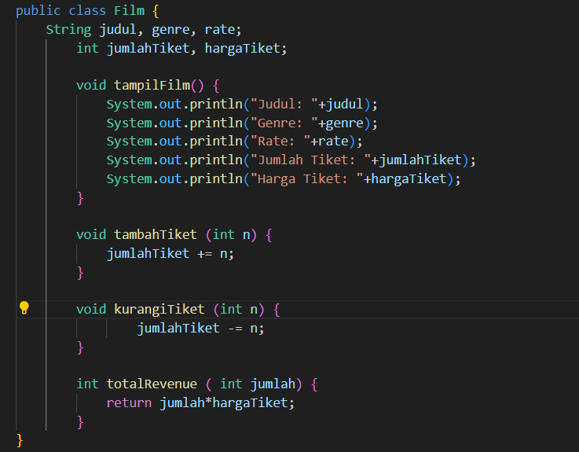
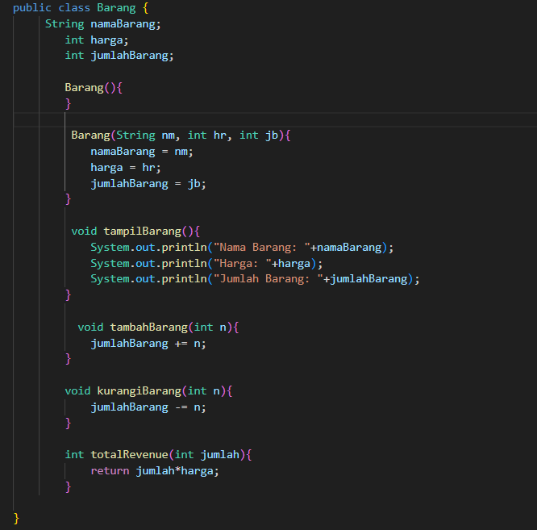
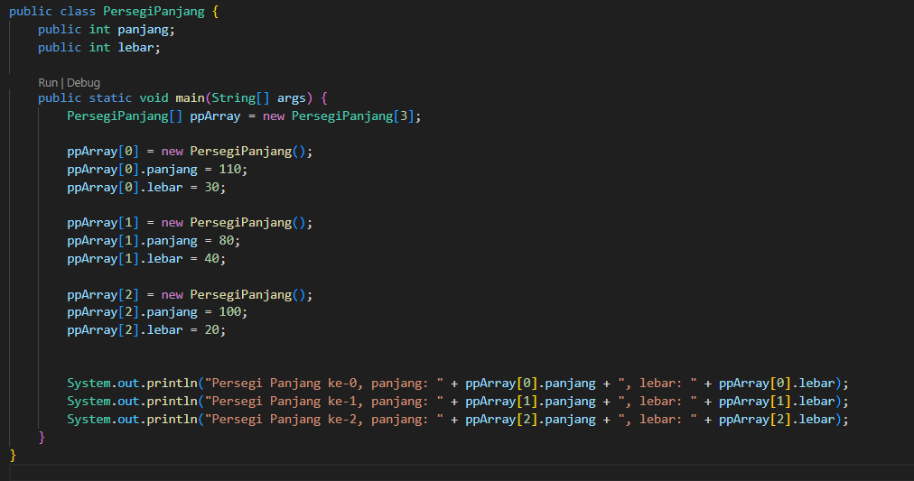
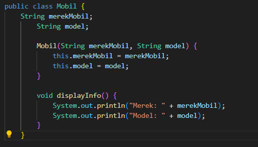
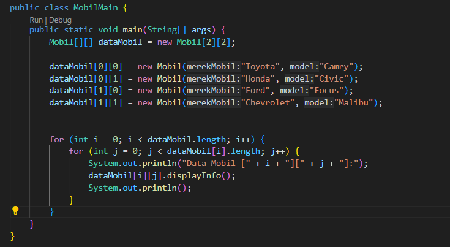
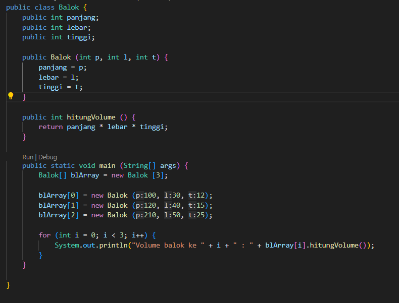

# Laporan Pertemuan 2
NIM: 2241760015

Nama: Oddis Nur Alifathur Razaaq

Kelas: SIB-2C

# Jobsheet 2

## 2.2	Deklarasi Class, Atribut dan Method
### 2.2.1	Langkah-langkah Percobaan

### 2.2.2	Verifikasi Hasil Percobaan

### 2.2.3   Pertanyaan
1. Sebutkan 2 karakteristik class/objek!
Jawab: Atribut dan juga method.

2. Kata kunci apakah yang digunakan untuk mendeklarasikan class?
Jawab: Kata kunci "class".

3. Perhatikan class Film yang ada di Praktikum di atas, ada berapa atribut yang dimiliki oleh class tersebut? Sebutkan! Dan pada baris berapa saja deklarasi atribut dilakukan?
Jawab: Ada 5 atribut

       1. judul (String)
       2. genre (String)
       3. rate (String)
       4. jumlahTiket (int)
       5. hargaTiket (int)
    
    Deklarasi atribut dilakukan pada baris berikut:

       1. String judul, genre, rate; (Baris 2)
       2. int jumlahTiket, hargaTiket; (Baris 3)

4. Ada berapa method yang dimiliki oleh class tersebut? Sebutkan!
Jawab: Ada 4 method

        1. tampilFilm()
        2. tambahTiket(int n)
        3. kurangiTiket(int n)
        4. totalRevenue(int jumlah)

5. Perhatikan method kurangiTiket() yang ada di class Film, modifikasi isi method tersebut sehingga proses pengurangan hanya dilakukan jika stok masih ada (masih lebih besar dari 0)
Jawab:

6. Menurut Anda, mengapa method tambahTiket() dibuat dengan memiliki 1 parameter berupa bilangan int?
Jawab: Agar kita dapat dengan mudah menentukan jumlah tiket yang ingin ditambahakan ke dalam stok film saat pemanggilan method, dan kita dapat dengan mudah mengatur nilai parameter sesuai dengan jumlah tiket yang ingin ditambahkan.

7. Menurut Anda, mengapa method totalRevenue() memiliki tipe data int?
Jawab: Karena method totalRevenue() lebih tepat dan sesuai memiliki tipe data int karena pendapatan umumnya dihitung berdasarkan jumlah tiket yang terjual dikalikan dengan harga tiket, hasilnya akan berupa bilangan bulat.

8. Menurut Anda, mengapa method tambahTiket() memiliki tipe data void?
Jawab: Karena method tambahTiket() tujuannya adalah untuk mengubah nilai atribut jumlahTiket dalam objek Film, bukan untuk mengembalikan nilai. Dalam hal ini, tipe data void menunjukkan bahwa metode ini tidak akan mengembalikan hasil atau nilai apapun setelah dijalankan.

## 2.3	Instansiasi Objek dan Mengakses Atribut & Method
### 2.3.1	Langkah-langkah Percobaan

### 2.3.2	Verifikasi Hasil Percobaan

### 2.3.3   Pertanyaan
1. Pada class FilmMain, pada kode apa yang digunakan untuk proses instansiasi? Apa nama objek yang dihasilkan?
Jawab: Pada kode Film film1 = new Film();, nama objek yang dihasilkan adalah film1

2. Bagaimana cara mengakses atribut dan method dari suatu objek?
Jawab: Untuk mengakses atribut dan method dari suatu objek adalah dengan menggunakan nama objek yang telaah dideklarasikan sebelumnya, kemudian diikuti dengan tanda titik dan diikuti dengan nama atribut atau method yang ingin diakses. Contoh akses atribut:film1.judul = "Quantumania Mancing", film1.genre = "Action Comedy". Kemudian untuk contoh pemanggilan method:
Contoh pemanggilan method: film1.tampilFilm(), film1.tambahTiket(1), film1.kurangiTiket(3);

## 2.4	Membuat Konstruktor
### 2.4.1	Langkah-langkah Percobaan
-

-

### 2.4.2	Verifikasi Hasil Percobaan

### 2.4.3   Pertanyaan
1. Perhatikan class Film yang ada di Praktikum 2.4.1, pada baris berapakah deklarasi konstruktor berparameter dilakukan?
Jawab: Deklarasi konstruktor berparameter dilakukan pada baris ke 8 sampai ke 14.
Kode: 
Film(String jd, String gr, String rt, int jt, int ht) {
        judul = jd;
        genre = gr;
        rate = rt;
        jumlahTiket = jt;
        hargaTiket = ht;
    }

2. Perhatikan class FilmMain di Praktikum 2.4.1, apa sebenarnya yang dilakukan pada baris program dibawah ini?
Jawab: Pembuatan objek film2 dengan menggunakan konstruktor Film (String jd, String gr, String rt, int jt, int ht). Konstruktor tersebut menerima lima argumen berurutan, yaitu:
        1. jd: "Maniaquantum" (judul film),
        2. gr: "Horor" (genre film),
        3. rt: "Dewasa" (rating film),
        4. jt: 2000 (jumlah tiket film), dan
        5. ht: 40000 (harga tiket film).
Dengan menggunakan konstruktor tersebut, objek film2 dibuat dan atribut- atributnya diisi dengan nilai-nilai yang sesuai. Sehingga, objek film2 akan memiliki atribut-atribut dengan nilai yang telah ditentukan tersebut.

3. Coba buat objek dengan nama film3 dengan menggunakan konstruktor berparameter dari class Barang.
Jawab:
-

-

- Output

## 2.5	Membuat Array dari Object, Mengisi dan Menampilkan
### 2.5.1	Langkah-langkah Percobaan

### 2.5.2	Verifikasi Hasil Percobaan

### 2.5.3   Pertanyaan
1. Berdasarkan uji coba 3.2, apakah class yang akan dibuat array of object harus selalu memiliki atribut dan sekaligus method?Jelaskan!
Jawab: Tidak, class yang digunakan untuk membuat array of object tidak harus selalu memiliki atribut dan method. Dalam contoh tersebut, class PersegiPanjang hanya memiliki dua atribut yaitu panjang dan lebar tanpa adanya method tambahan. Namun, kita juga masih dapat menggunakan class tersebut untuk membuat array of objects dan menyimpan serta mengakses data persegi panjang yang berbeda-beda. Jadi, tidak ada persyaratan khusus bahwa class harus memiliki atribut dan method tambahan untuk digunakan dalam array of objects.

2. Apakah class PersegiPanjang memiliki konstruktor?Jika tidak, kenapa dilakukan pemanggilan konstruktur pada baris program berikut :
Jawab: Tidak, class PersegiPanjang tidak memiliki konstruktor yang ditentukan secara eksplisit. Namun, Java akan secara otomatis menyediakan konstruktor default jika tidak ada konstruktor lain yang ditentukan dalam class. Sehingga pada baris "ppArray[1] = new PersegiPanjang();", dilakukan pemanggilan konstruktor default yang dihasilkan secara otomatis oleh Java. Hal ini dilakukan untuk membuat objek PersegiPanjang baru dan menginisialisasinya. Meskipun tidak ditulis secara eksplisit, pemanggilan konstruktor default tetap diperlukan untuk membuat objek yang valid dan memungkinkan inisialisasi nilai-nilai atribut pada objek PersegiPanjang yang akan disimpan dalam array ppArray.

3. Apa yang dimaksud dengan kode berikut ini:
Jawab: Kode PersegiPanjang[] ppArray = new PersegiPanjang[3]; digunakan untuk membuat sebuah array yang dapat menampung 3 objek dari tipe PersegiPanjang. Array tersebut disimpan dalam variabel ppArray. Kemudian, setelah dideklarasikan, array tersebut akan diinisialisasi menggunakan operator new untuk membuat ruang dalam memori yang cukup untuk menampung 3 objek PersegiPanjang.

4. Apa yang dimaksud dengan kode berikut ini:
Jawab: Kode tersebut digunakan untuk membuat objek PersegiPanjang baru dan menyimpannya pada indeks ke-1 dari array ppArray. Pada baris ppArray[1] = new PersegiPanjang();`, kita menginisialisasi elemen kedua dari array dengan objek PersegiPanjang baru yang dibuat menggunakan konstruktor default. Setelah itu, kita mengakses objek PersegiPanjang yang terdapat pada elemen kedua array (indeks 1) dan mengatur nilai atribut panjang menjadi 80 dan atribut lebar menjadi 40.

5. Mengapa class main dan juga class PersegiPanjang dipisahkan pada uji coba 3.2?
Jawab: Karena untuk memisahkan tanggung jawab masing-masing kelas, karena dengan begitu maka kita dapat dengan mudah mengelola dan memodifikasi kode di 
kedua kelas tersebut secara terpisah. Ini juga memungkinkan kita untuk menggunakan kelas PersegiPanjang di tempat lain dalam program atau bahkan dalam file yang berbeda tanpa harus mengubah kode pada class main.

## 2.6	Menerima Input Isian Array Menggunakan Looping
### 2.6.1	Langkah-langkah Percobaan

### 2.6.2	Verifikasi Hasil Percobaan

### 2.6.3   Pertanyaan
1. Apakah array of object dapat diimplementasikan pada array 2 Dimensi?
Jawab: Ya, array of object dapat diimplementasikan pada array 2 dimensi. Array of objects dapat diimplementasikan dalam array dua dimensi karena objek dalam Java adalah nilai yang dapat ditampung dalam array seperti halnya tipe data primitif. Ketika Anda membuat array dua dimensi, Anda sebenarnya membuat matriks dari elemen-elemen, dan elemen-elemen tersebut dapat berupa objek. Setiap sel dalam matriks dapat menyimpan objek yang memiliki atribut dan metode masing-masing.

2. Jika jawaban soal no satu iya, berikan contohnya! Jika tidak, jelaskan!
Jawab:
-

-

- Output

3. Jika diketahui terdapat class Persegi yang memiliki atribut sisi bertipe integer, maka kode dibawah ini akan memunculkan error saat dijalankan. Mengapa?
Jawab: Hal ini terjadi karena telah membuat sebuah array dari objek Persegi (Persegi[] pgArray = new Persegi[100];), tetapi elemen-elemen dalam array tersebut belum diinisialisasi. Dalam Java, ketika membuat sebuah array, elemen-elemen di dalamnya akan diinisialisasi dengan nilai default sesuai dengan tipe datanya. Untuk tipe data primitif seperti int, nilai defaultnya adalah 0, tetapi untuk objek, nilai defaultnya adalah null.
 
4. Modifikasi kode program pada praktikum 3.3 agar length array menjadi inputan dengan Scanner!
Jawab:
- 

- Output

5. Apakah boleh Jika terjadi duplikasi instansiasi array of objek, misalkan saja instansiasi dilakukan pada ppArray[i] sekaligus ppArray[0]?Jelaskan !
Jawab: Tidak boleh melakukan duplikasi instansiasi pada elemen array of objek yang sama. Hal ini dapat menyebabkan hilangnya referensi ke objek awal dan mempengaruhi perilaku program.

## 2.7	Operasi Matematika Atribut Object Array
### 2.7.1	Langkah-langkah Percobaan

### 2.7.2	Verifikasi Hasil Percobaan

### 2.7.3   Pertanyaan
1. Dapatkah konstruktor berjumlah lebih dalam satu kelas? Jelaskan dengan contoh!
Jawab: Ya, dalam satu kelas dapat memiliki lebih dari satu konstruktor. Hal ini memungkinkan untuk menginisialisasi objek dengan berbagai cara yang berbeda, tergantung pada parameter yang diberikan saat membuat objek tersebut. Contoh dalam kode di atas , dalam class Balok konstruktor pertama tidak memiliki parameter dan menginisialisasi panjang, lebar, dan tinggi dengan nilai default 0. Konstruktor kedua menerima tiga parameter panjang, lebar, dan tinggi, dan menginisialisasi atribut dengan nilai yang diberikan. Dengan adanya dua konstruktor tersebut, kita dapat membuat objek Balok menggunakan konstruktor yang sesuai dengan kebutuhan kita.

2. Jika diketahui terdapat class Segitiga seperti berikut ini:
Tambahkan konstruktor pada class Segitiga tersebut yang berisi parameter int a, int t yang masing-masing digunakan untuk mengisikan atribut alas dan tinggi.

3. Tambahkan method hitungLuas() dan hitungKeliling() pada class Segitiga tersebut. Asumsi segitiga adalah segitiga siku-siku. (Hint: Anda dapat menggunakan bantuan library Math pada Java untuk mengkalkulasi sisi miring)
- 

- Output

4. Pada fungsi main, buat array Segitiga sgArray yang berisi 4 elemen, isikan masing- masing atributnya sebagai berikut:
sgArray ke-0	alas: 10, tinggi: 4
sgArray ke-1	alas: 20, tinggi: 10
sgArray ke-2	alas: 15, tinggi: 6
sgArray ke-3	alas: 25, tinggi: 10
Kemudian menggunakan looping, cetak luas dan keliling dengan cara memanggil method
hitungLuas() dan hitungKeliling().
- 

- Output

## 2.7	Tugas Praktikum
1. Buat program berdasarkan diagram class berikut ini!

Nasabah
Id: int
nama: String
alamat: String
noHP: int noRek: int
saldo: int
jmlHutang: float
statusAktif: boolean

lihatSaldo(): int
menabung(deposit: int): int
tarikTunai(jmlTarik: int): int
bukaRekening(): void
tutupRekening(): void
berhutang(jmlHutang: int): void

o Method lihatSaldo() digunakan untuk melihat kondisi saldo tabungan
o Method menabung() digunakan untuk menambah saldo sesuai nominal parameter deposit yang dimasukkan
o Method tarikTunai() digunakan untuk mengurangi saldo sejumlah parameter jmlTarik
o Method bukaRekening() digunakan nasabah untuk pertama kali. Jika nasabah belum memiliki rekening, maka statusAktif false dan tidak boleh melakukan aktifitas lihatSaldo(), menabung(), tarikTunai(), tutupRekening(), dan berhutang().
o Method tutupRekening() digunakan untuk menonaktifkan rekening sehinggan nasabah tidak lagi dapat melakukan aktifitas lihatSaldo(), menabung(), tarikTunai(), tutupRekening(), dan berhutang().
o Method berhutang() digunakan untuk mengajukan pinjaman dengan aturan berikut:
        - Jika jmlHutang >= saldo, akan muncul peringatan ajuan peminjaman ditolak
        - Jika jmlHutang <= saldo, pinjaman disetujui dan dimunculkan simulasi skema cicilan per bulan
        - Seluruh cicilan harus dihitung dalam waktu 6 bulan
        - Simulasi skema cicilan per bulan dihitung dari jumlah hutang di rekening/6. Jangan lupa menggunakan konversi tipe data int ke float.
Jawab:
- 

- Output

2. Berdasarkan soal nomor 1, terapkan kasus lebih dari 1 nasabah menggunakan object of array!
Jawab:
- 

- Output

3. Berdasarkan soal nomor 1 dan 2, terapkan kasus 1 nasabah dapat memiliki lebih dari 1 rekening menggunakan array biasa!
- 

- Output

