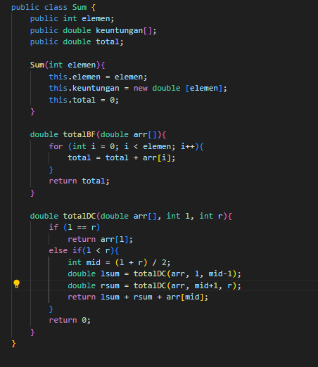

# Laporan Pertemuan 3
NIM: 2241760015

Nama: Oddis Nur Alifathur Razaaq

Kelas: SIB-2C

# Jobsheet 4

## 4.2 Menghitung Nilai Faktorial dengan Algoritma Brute Force dan Divide and Conquer
### 4.2.1 Langkah-langkah Percobaan
- 

- 

### 4.2.2 Verifikasi Hasil Percobaan

### 4.2.3 Pertanyaan
1. Jelaskan mengenai base line Algoritma Divide Conquer untuk melakukan pencarian nilai faktorial!
Jawab: Jika nilai n sama dengan 0 maka hasil faktorial adalah 1. Jika nilai n tidak sama dengan 0, maka hasil faktorial adalah n dikalikan dengan hasil faktorial dari (n-1). Kemudian Jika n adalah 0, maka hasil faktorial adalah 1, yang merupakan basis kasus atau kondisi terminasi algoritma dalam langkah pertama, ini karena faktorial dari 0 selalu 1. Selanjutnya, kita dapat menghitung faktorial n dengan mengalikan nilai n dengan hasil faktorial dari (n-1). Prosedur ini berbalik dan berlanjut sampai n mencapai nilai 0, ketika kasus basis telah tercapai. Setelah itu, algoritma akan berhenti.

2. Pada implementasi Algoritma Divide and Conquer Faktorial apakah lengkap terdiri dari 3 tahapan
divide, conquer, combine? Jelaskan masing-masing bagiannya pada kode program!
Jawab: 
- Divide (Pembagian)

Bagian kode programnya
if (n != 1) {
    int fakto = n * faktorialDC(n - 1); // Rekursi dengan n yang lebih kecil
    return fakto;
}

Tahap divide ini terjadi dalam metode faktorialDC(int n).
Pada tahap ini, yaitu menghitung faktorial dari nilai n, dibagi menjadi masalah yang lebih kecil. 8Setiap langkah pembagian mengurangi nilai n sebesar 1 dan terus memanggil fungsi faktorial dengan nilai yang lebih kecil (n - 1).

- Conquer (Penyelesaian Submasalah)

Bagian kode programnya
Copy code
if (n == 1) {
    return 1;
}

Tahap conquer ini terjadi ketika algoritma mencapai kasus dasar (base case) ketika n sama dengan 1. Pada kasus dasar, nilai faktorial adalah 1, dan ini menjadi hasil kontribusi dari submasalah yang lebih kecil.

- Combine (Penggabungan Solusi)
Tidak ada tahap combine yang eksplisit karena hasil dari submasalah yang lebih kecil (rekursif) tidak perlu digabungkan secara khusus.

3. Apakah memungkinkan perulangan pada method faktorialBF() dirubah selain menggunakan
for?Buktikan!
Jawab: Ya memungkinkan,selain menggunakan for perulangan pada method faktorialBF() dapat diubah dengan menggunakan perulangan do-while. Nanti juga akan mendapatkan hasil yang sama.
Bukti:

Hasil:

4. Tambahkan pegecekan waktu eksekusi kedua jenis method tersebut!
Jawab: 
- 

- 

5. Buktikan dengan inputan elemen yang di atas 20 angka, apakah ada perbedaan waktu eksekusi?
Jawab: 

## 4.3 Menghitung Hasil Pangkat dengan Algoritma Brute Force dan Divide and Conquer
### 4.3.1 Langkah-langkah Percobaan
- 

- 

### 4.3.2 Verifikasi Hasil Percobaan

### 4.3.3 Pertanyaan
1. Jelaskan mengenai perbedaan 2 method yang dibuat yaitu PangkatBF() dan PangkatDC()!
Jawab: perbedaan utama antara keduanya terletak pada cara mengatasi masalah pemangkatan. pangkatBF() melakukan perkalian berulang, sementara pangkatDC() memecah masalah menjadi submasalah yang lebih kecil dan menggabungkan hasilnya, yang membuatnya lebih efisien dalam hal waktu eksekusi, terutama untuk pangkat yang besar.

- Pangkat Brute Force (pangkatBF()):
Metode ini mengikuti pendekatan sederhana dengan melakukan perkalian berulang sebanyak n-1 kali untuk menghitung hasil pemangkatan a^n.

Sedangkan,

- Pangkat Divide and Conquer (pangkatDC()):
Metode ini memecah masalah pemangkatan menjadi submasalah yang lebih kecil (menggunakan pendekatan Divide Conquer) dan kemudian menggabungkan hasilnya.

2. Pada method PangkatDC() terdapat potongan program sebagai berikut

if(n%2==1)
   return (pangkatDC(a,n/2)*pangkatDC(a,n/2)*a);
else
    return (pangkatDC(a,n/2)*pangkatDC(a,n/2));

Jelaskan arti potongan kode tersebut
Jawab: potongan kode di atas digunakan untuk membagi masalah pemangkatan a pangkat n menjadi masalah yang lebih kecil dan menggabungkan hasilnya.

- if (n % 2 == 1): Ini adalah kondisi yang memeriksa apakah pangkat n adalah bilangan ganjil. Jika kondisi ini benar, berarti n adalah bilangan ganjil.

- Jika n adalah bilangan ganjil (kondisi if terpenuhi), maka kode di dalam blok if akan dieksekusi:
pangkatDC(a, n / 2) adalah rekursi yang digunakan untuk menghitung a pangkat setengah dari n. Ini membagi masalah menjadi dua bagian dengan memangkas pangkat menjadi setengah dari nilai sebelumnya. Kemudian hasil dari pangkatDC(a, n / 2) dikalikan dengan dirinya sendiri. Ini berarti kita menghitung a pangkat setengah dari n dan mengkuadratkannya. Terakhir, hasilnya dikalikan dengan a lagi. Hal ini dilakukan karena pangkat n adalah ganjil, sehingga kita perlu mengalikan hasil sebelumnya dengan a sekali lagi untuk mendapatkan hasil akhir a pangkat n.

- Jika n adalah bilangan genap (kondisi if tidak terpenuhi), maka kode di dalam blok else akan dieksekusi:
Kode ini serupa dengan yang ada di dalam blok if, kecuali bahwa tidak ada perkalian dengan a pada tahap akhir. Ini karena jika n adalah bilangan genap, kita hanya menghitung a pangkat setengah dari n dan mengkuadratkannya, tanpa perlu mengalikan hasilnya dengan a lagi.

3. Apakah tahap combine sudah termasuk dalam kode tersebut?Tunjukkan!
Jawab: Belum, kode tersebut belum mencapai tahap combine sepenuhnya. Tahap combine dalam algoritma Divide and Conquer seharusnya menggabungkan hasil dari dua submasalah yang lebih kecil. Namun, dalam kode berikut ini, hasil dari submasalah yang lebih kecil hanya digunakan dalam perhitungan tetapi belum digabungkan menjadi hasil akhir.

if (n % 2 == 1)
    return (pangkatDC(a, n / 2) * pangkatDC(a, n / 2) * a);
else
    return (pangkatDC(a, n / 2) * pangkatDC(a, n / 2));

Dalam kode diatas itu mengalikan hasil submasalah yang lebih kecil dan menggandakannya dengan a jika n ganjil. Namun, tahap combine itu seharusnya menggabungkan hasil kedua submasalah tersebut menjadi satu hasil akhir. 

4. Modifikasi kode program tersebut, anggap proses pengisian atribut dilakukan dengan konstruktor.
Jawab:

5. Tambahkan menu agar salah satu method yang terpilih saja yang akan dijalankan!
Jawab:
- 

- Hasil

## 4.4 Menghitung Sum Array dengan Algoritma Brute Force dan Divide and Conquer
### 4.4.1 Langkah-langkah Percobaan
- 

- 

### 4.4.2 Verifikasi Hasil Percobaan

### 4.4.3 Pertanyaan
1. Berikan ilustrasi perbedaan perhitungan keuntungan dengan method TotalBF() ataupun TotalDC()
Jawab: Misalkan saya memiliki data keuntungan sebuah perusahaan selama beberapa bulan sebagai berikut:

keuntungan = [8.0, 12.0, 5.0, 15.0, 10.0]

- Metode Brute Force (totalBF()): Metode ini menggunakan pendekatan langsung dengan cara menjumlahkan semua elemen dalam array satu per satu.
    - Langkah-langkah perhitungan:
        Total = 0.0 + 8.0 = 8.0
        Total = 8.0 + 12.0 = 20.0
        Total = 20.0 + 5.0 = 25.0
        Total = 25.0 + 15.0 = 40.0
        Total = 40.0 + 10.0 = 50.0
     Hasil total keuntungan adalah 50.0.
    - Metode ini melakukan perulangan sebanyak jumlah bulan (elemen) kali untuk menjumlahkan semua nilai.

- Metode Divide and Conquer (totalDC(): Metode ini membagi masalah menjadi dua bagian yang lebih kecil, menghitung total keuntungan untuk setiap bagian tersebut, dan menggabungkannya untuk mendapatkan total akhir.
    - Langkah-langkah perhitungan (rekursif):
    - Bagian pertama: [8.0, 12.0, 5.0]
        
        lsum = 8.0 + 12.0 = 20.0
        rsum = 5.0
        Total = lsum + rsum = 20.0 + 5.0 = 25.0
        
     - Bagian kedua: [15.0, 10.0]
        
        lsum = 15.0
        rsum = 10.0
        Total = lsum + rsum = 15.0 + 10.0 = 25.0
        
    Total akhir adalah hasil penjumlahan dari kedua bagian: 25.0 + 25.0 = 50.0
     - Metode ini membagi masalah menjadi dua bagian dan secara rekursif menghitung total keuntungan dalam setiap bagian, kemudian menggabungkannya menjadi total akhir.
     - Metode ini lebih efisien karena meminimalkan jumlah operasi penjumlahan yang perlu dilakukan, terutama ketika data keuntungan sangat besar.

Jadi kesimpulannya metode Divide and Conquer (totalDC()) lebih efisien dalam menghitung total keuntungan, dan hasilnya sama dengan metode Brute Force (totalBF()), yaitu 50.0.

2. Perhatikan output dari kedua jenis algoritma tersebut bisa jadi memiliki hasil berbeda dibelakang koma. Bagaimana membatasi output di belakang koma agar menjadi standar untuk kedua jenis algoritma tersebut.
Jawab:
- 

- 

- Hasil

3. Mengapa terdapat formulasi return value berikut?Jelaskan!
Jawab: Karena ini adalah langkah penting dalam proses penggabungan (combine) hasil dari dua submasalah yang lebih kecil menjadi hasil akhir.

    - lsum: Total keuntungan dari subarray kiri.
    - rsum: Total keuntungan dari subarray kanan.
    - arr[mid]: Keuntungan dari bulan tengah, yang merupakan elemen tengah array.

Sehingga formulasi return value digunakan untuk menggabungkan hasil total keuntungan dari submasalah kiri, hasil total keuntungan dari submasalah kanan, dan nilai keuntungan dari elemen tengah agar menghasilkan total keuntungan dari seluruh array. Ini adalah cara algoritma Divide and Conquer memecah masalah menjadi submasalah yang lebih kecil, menghitung total keuntungan untuk masing-masing submasalah, dan kemudian menggabungkan hasilnya untuk mendapatkan total akhir.

4. Kenapa dibutuhkan variable mid pada method TotalDC()?
Jawab: Karena agar dapat digunakan untuk menentukan elemen tengah (middle element) dari array yang akan dibagi menjadi dua submasalah. Dan juga membantu dalam mengidentifikasi elemen tengah yang diperlukan untuk perhitungan dan menentukan rentang yang tepat untuk submasalah yang lebih kecil. 

5. Program perhitungan keuntungan suatu perusahaan ini hanya untuk satu perusahaan saja. Bagaimana cara menghitung sekaligus keuntungan beberapa bulan untuk beberapa perusahaan.(Setiap perusahaan bisa saja memiliki jumlah bulan berbeda-beda)? Buktikan dengan program!
Jawab:
- 

- 

## 4.5 Latihan Praktikum
1. Suatu Perguruan Tinggi di kota Malang sedang mengadakan pemilihan suara untuk memilih ketua BEM tahun 2022. Jika jumlah suara yang terkumpul diumpamakan selalu genap. Maka dengan inputan kandidat terpilih, carilah mayoritas jumlah suara untuk masing-masing kandidat. (Jumlah elemen array dan hasil pemilhan suara merupakan inputan user). Elemen Mayoritas : Elemen mayoritas di dalam A adalah elemen yang terdapat pada lebih dari n/2 posisi. Contohnya, jika n=6 atau n=7 maka nilai mayoritas paling sedikit adalah 4. Berasal dari (7/2)+1 atau (6/2)+1). Nilai mayoritas berbeda konsep dengan menghitung total suara terbanyak kandidat terpilih ! 
Jawab:
- 

- 

- 

