# Laporan Pertemuan 5
NIM: 2241760015

Nama: Oddis Nur Alifathur Razaaq

Kelas: SIB-2C

# Jobsheet 4
## 4.2 Praktikum 1
### 4.2.1 Langkah-langkah Percobaan
- 
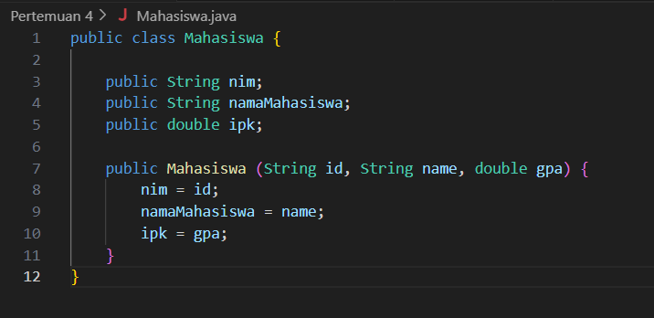

- 
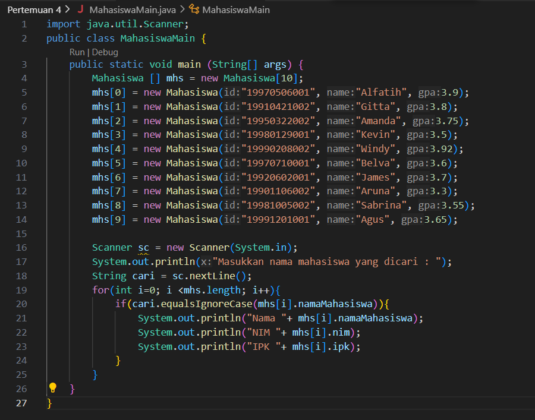

### 4.2.2 Verifikasi Hasil Percobaan

### 4.2.3 Pertanyaan
1. Perhatikan class MahasiswaMain, jelaskan fungsi kode program berikut ini!
if(cari.equalsIgnoreCase(mhs[i].namaMahasiswa))
Jawab: 
    - cari adalah variabel yang menyimpan inputan pengguna berupa nama mahasiswa yang ingin dicari.
    - mhs[i].namaMahasiswa adalah atribut (variabel instance) namaMahasiswa dari objek Mahasiswa yang ada dalam array mhs pada indeks ke-i.
    - equalsIgnoreCase adalah sebuah metode yang digunakan untuk membandingkan dua string secara tidak memperhatikan huruf besar atau kecil (case-insensitive). Ini berarti, metode ini akan mengembalikan nilai true jika isi string cari sama dengan isi string mhs[i].namaMahasiswa, tanpa memperhatikan huruf besar atau kecil.

Jadi, kode ini digunakan untuk mencari nama mahasiswa dalam array mhs yang sama dengan input yang dimasukkan oleh pengguna (dalam hal ini, cari) tanpa memperhatikan perbedaan huruf besar atau kecil.

2. Lakukan modifikasi pada program tersebut, sehingga jika data yang dicari tidak ditemukan, maka
akan menampilkan “Data tidak ditemukan”!
Jawab:
- 

- 

3. Lakukan modifikasi pada program tersebut agar pencarian dilakukan bukan berdasarkan nama
mahasiswa, melainkan berdasarkan IPK!
Jawab:
- 

- 

- 

## 4.3 Praktikum 2
### 4.3.1 Langkah-langkah Percobaan
- 
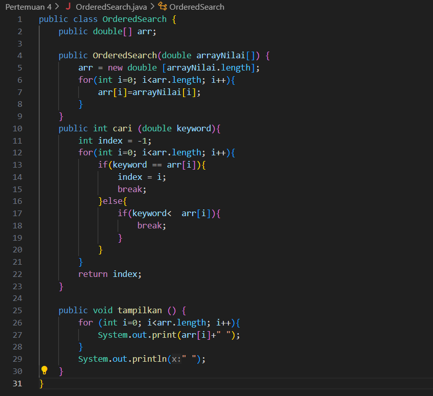

- 
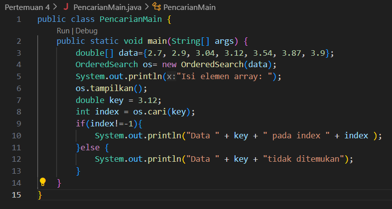

### 4.3.2 Verifikasi Hasil Percobaan

### 4.3.3 Pertanyaan
1. Perhatikan class PencarianMain, jelaskan fungsi dari kode kode program berikut ini!
OrderedSearch os= new OrderedSearch(data);
Jawab:
    - OrderedSearch adalah nama sebuah kelas yang digunakan untuk melakukan pencarian data dalam sebuah array yang telah diurutkan (ordered). Dalam kode program ini, OrderedSearch adalah kelas yang sudah ada sebelumnya dan digunakan untuk melakukan pencarian data dalam array yang akan dioperasikan.
    - os adalah sebuah variabel yang digunakan untuk membuat objek dari kelas OrderedSearch. Dengan kode ini, Anda membuat objek os yang akan digunakan untuk melakukan pencarian data dalam array.
    - new OrderedSearch(data) adalah cara untuk menginisialisasi objek os dengan mengirimkan array data sebagai argumen ke dalam konstruktor kelas OrderedSearch. Ini berarti objek os akan memiliki akses ke array data yang digunakan untuk melakukan pencarian.

Jadi pada baris kode ini digunakan untuk membuat objek dari kelas OrderedSearch yang akan digunakan untuk melakukan pencarian data dalam array data. Objek ini akan memiliki akses ke metode-metode dalam kelas OrderedSearch yang diperlukan untuk melakukan pencarian data di dalam array tersebut.

2. Perhatikan class Pencarian, pada method Cari terdapat dua kali break. Jelaskan fungsi masing masing break tersebut pada kode program tersebut!
Jawab: Statement break pertama digunakan untuk menghentikan loop ketika data yang dicari telah ditemukan dalam array. Sedangkan statement break kedua digunakan untuk menghentikan loop ketika nilai keyword lebih kecil daripada nilai yang ada dalam array, menunjukkan bahwa data tidak akan ditemukan dalam array yang diurutkan. 

3. Lakukan modifikasi pada program tersebut sehingga data array dapat bersifat dinamis (dapat
diinputkan oleh pengguna)!
Jawab:
- 

- 

## 4.4 Tugas
1. Terdapat sebuah array satu dimensi sebagai berikut:
Index 0 1 2 3 4 5 6 7 8 9
Array 17 20 26 33 37 41 53 65 73 83
Buatlah program untuk mencari sebuah nilai x dan tentukan jenis sequential search manakah yang optimal dan cocok untuk array diatas dengan:
a. x=41
b. x=50
Jawab: Jenis sequential search yang optimal dan cocok untuk array diatas adalah Ordered Sequential Search. Ini karena array telah diurutkan, dan dengan menggunakan sequential search dengan pengurutan, kita dapat menghentikan pencarian segera setelah menemukan nilai yang lebih besar dari x.

- 
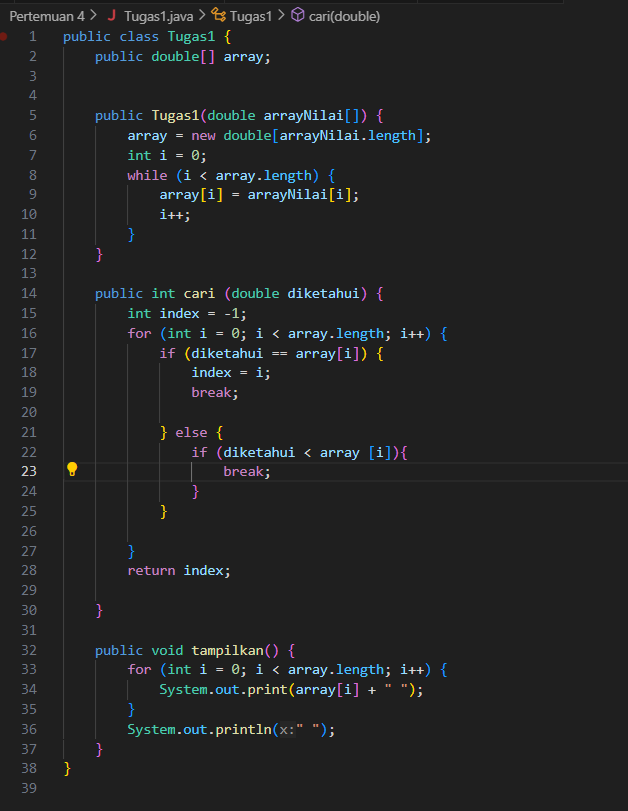

- 
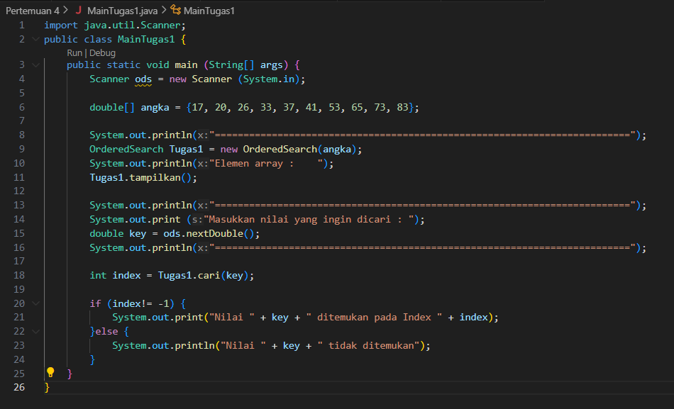

- Output

2. Terdapat sebuah array dua dimensi yang menggambarkan nama mahasiswa pada 3 kelompok yang berbeda dalam satu kelas. Baris menunjukkan kelompok, sedangkan kolom menunjukkan data mahasiswa dalam satu kelompok dengan contoh seperti di bawah ini.
Urutan 1 2 3 4 5
Kelompok Indeks 0 1 2 3 4
1 0 “Alfi” “Safira” “Tiara” “Arif” “Erdi”
2 1 “Yudha” “Nisa” “Yulia” “Fauzan” “Dwi”
3 2 “Dewa” “Ana” “Abdul” “Dani” “Ammar”
Berdasarkan data tersebut, buatlah program untuk melakukan pencarian data kelompok dan urutan mahasiswa, dimana data nama mahasiswa yang dicari diinputkan melalui keyboard!
Jawab:
- 
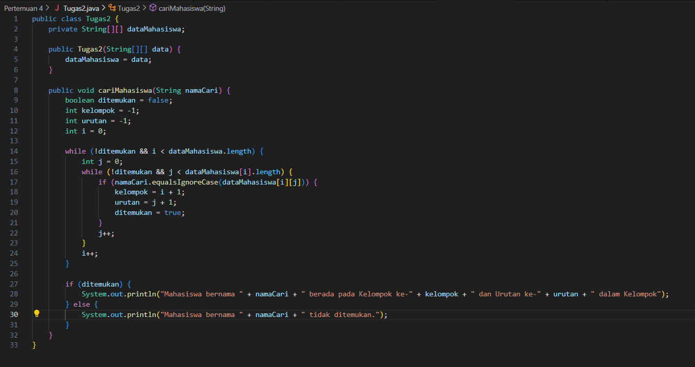

- 
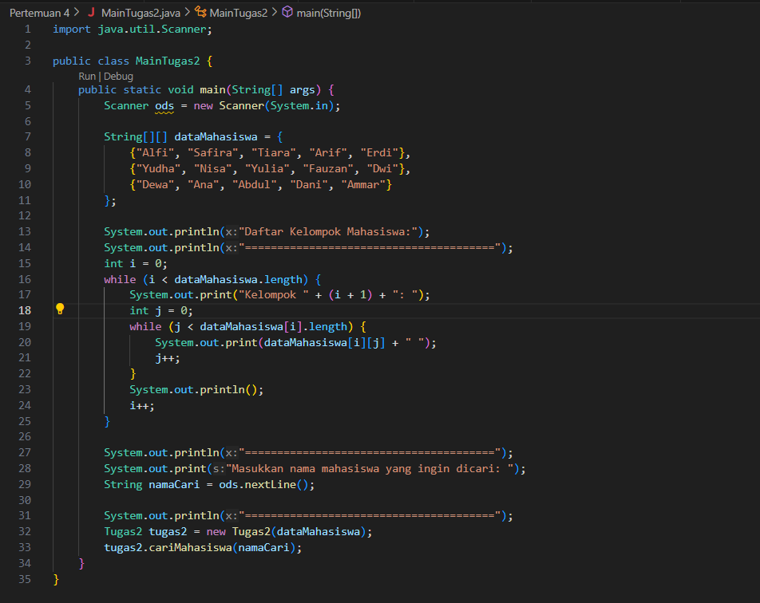

- Output

3. Terdapat sebuah array satu dimensi sebagai berikut:
Index 0 1 2 3 4 5 6 7 8 9
Array 12 15 6 3 70 51 83 15 3 83
Buatlah program untuk mencari dan mencetak isi array yang nilainya terbesar, serta mencetak di posisi mana saja nilai terbesar tersebut berada!
Jawab:
- 
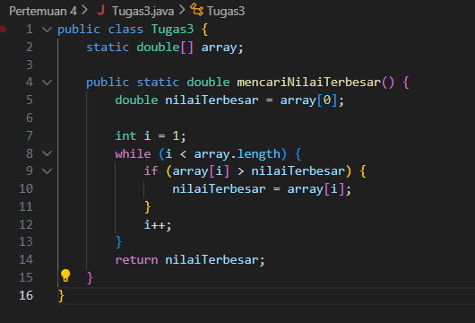

- 
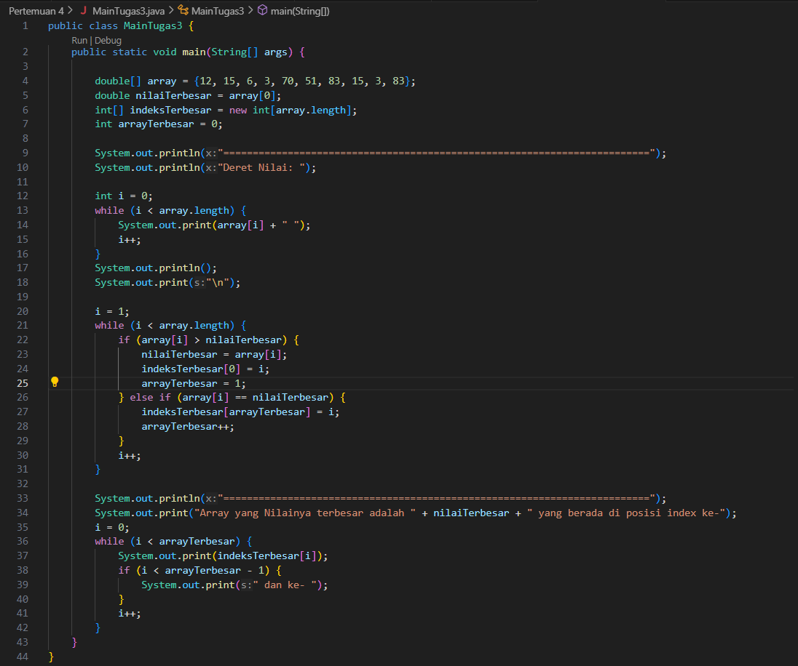

- Output 

4. Buatlah program untuk melakukan pencarian data penduduk berdasarkan NIK. Setiap penduduk mempunyai catatan data yang terdiri dari NIK, nama, alamat, dan jenis kelamin. Jumlah penduduk dan detail data penduduk diinputkan melalui keyboard. Kemudian data yang dicari juga diinputkan melalui keyboard!
Jawab:
- 
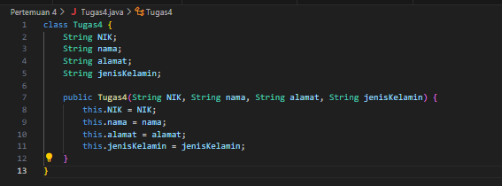

- 
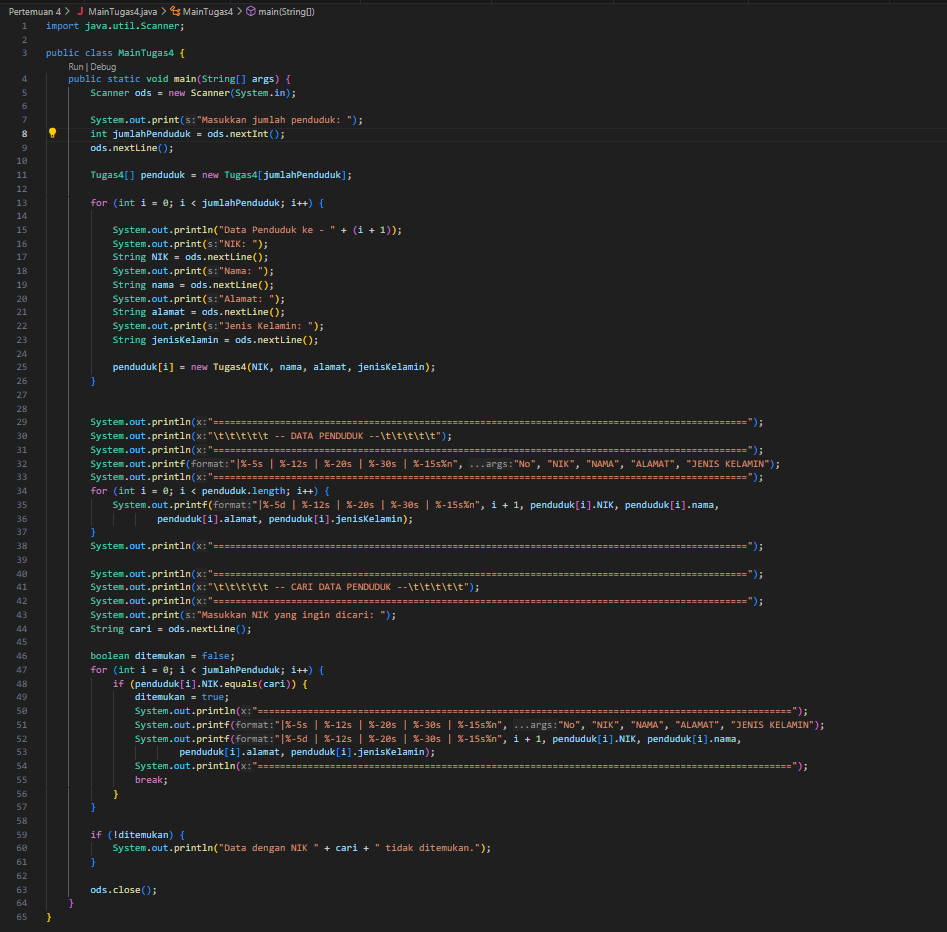

- Output
