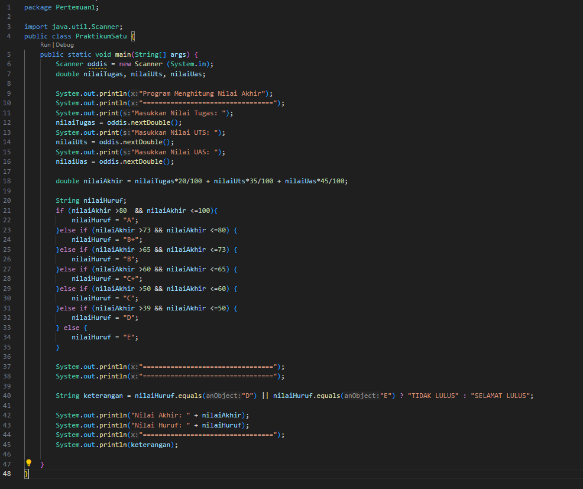
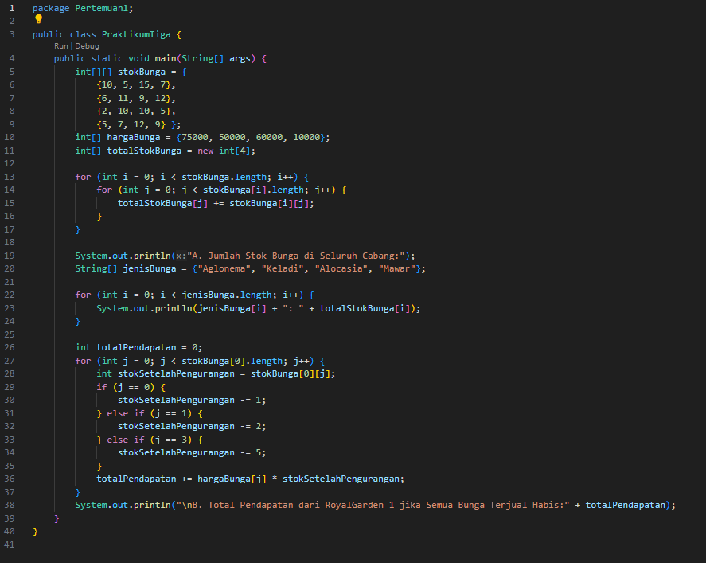
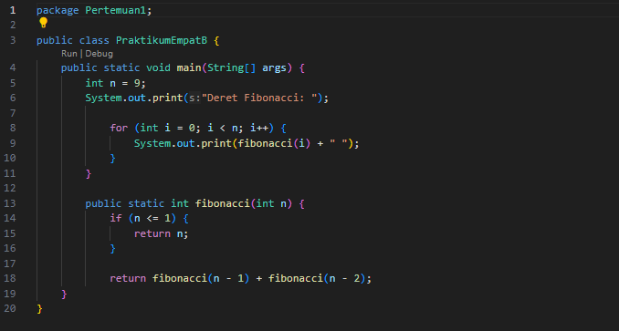
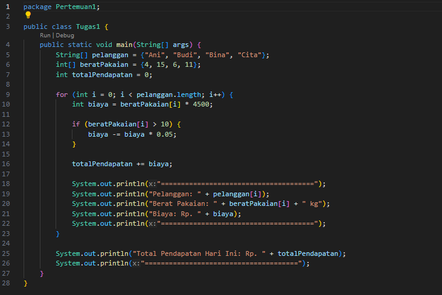
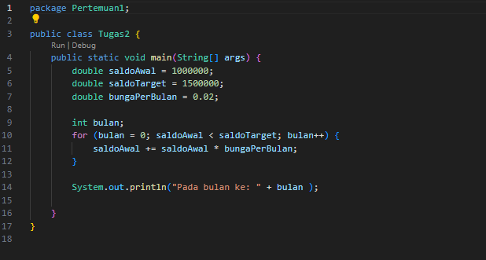
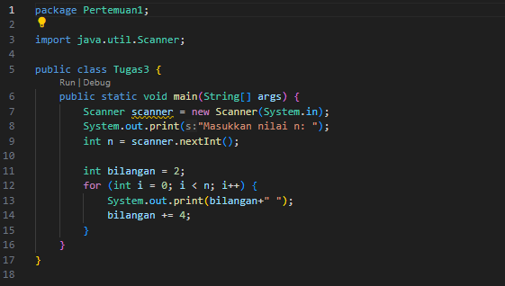

# Laporan Pertemuan 1
NIM: 2241760015

Nama: Oddis Nur Alifathur Razaaq

Kelas: SIB-2C

# Jobsheet 1
# Pertanyaan
## Praktikum pemilihan:

- Kode

- Hasil

## Praktikum perulangan:

- Kode

- Hasil

## Praktikum Array:

- Kode

- Hasil

## Praktikum Fungsi:

A. Konsep Perulangan

- Kode

- Hasil

B. Fungsi Rekursif

- Kode

- Hasil

# Tugas

## Tugas 1:

- Kode

- Hasil

## Tugas 2:

- Kode

- Hasil

## Tugas 3:

- Kode

- Hasil

## Tugas 4:

- Kode

- Hasil

