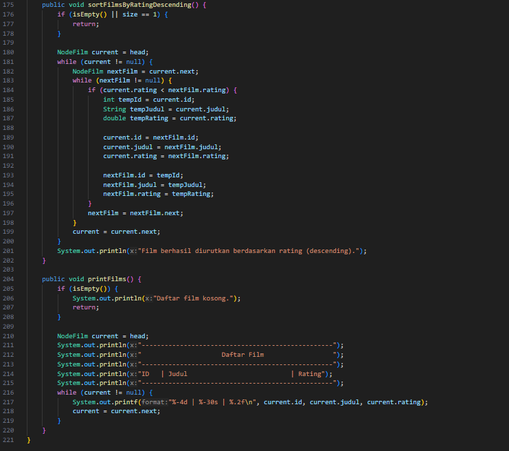
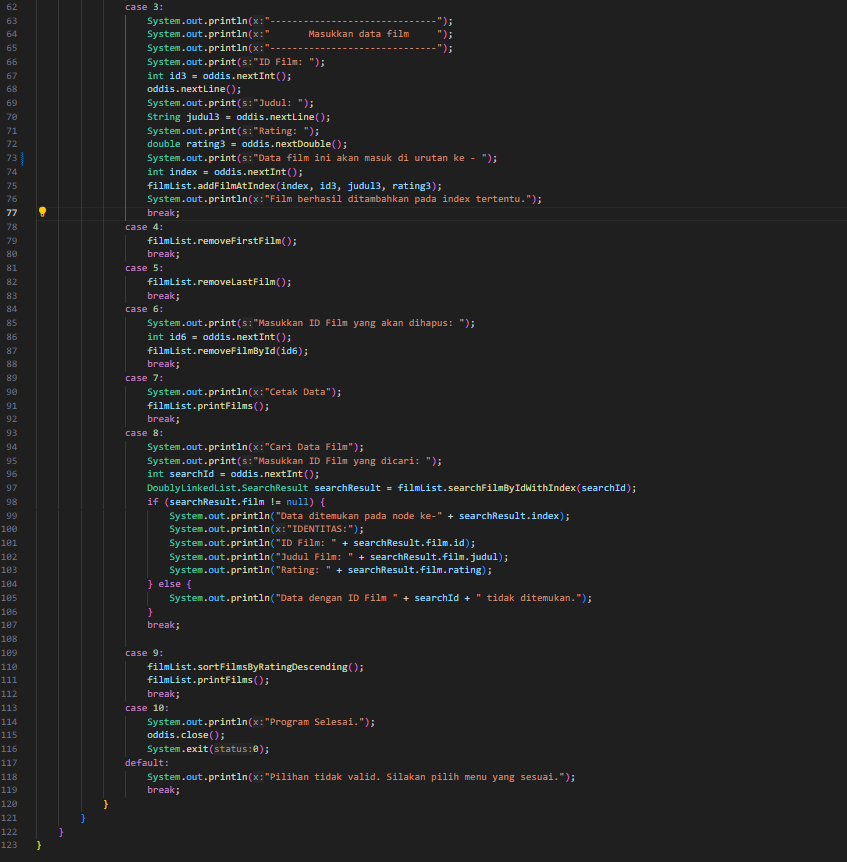
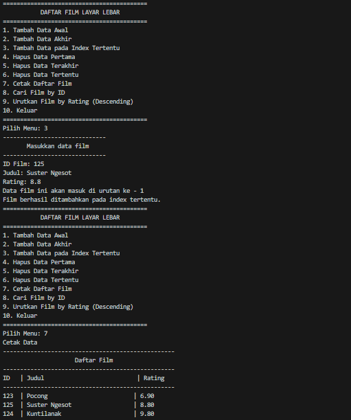
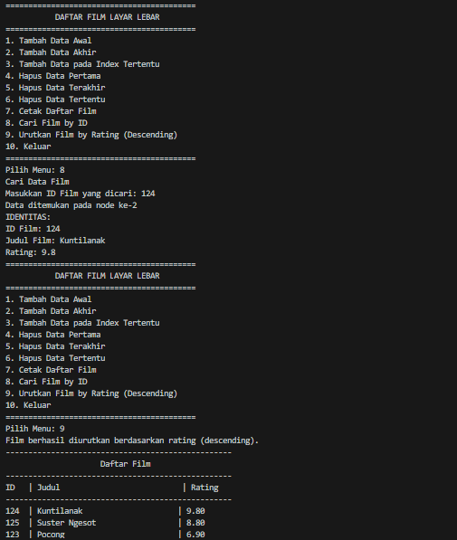
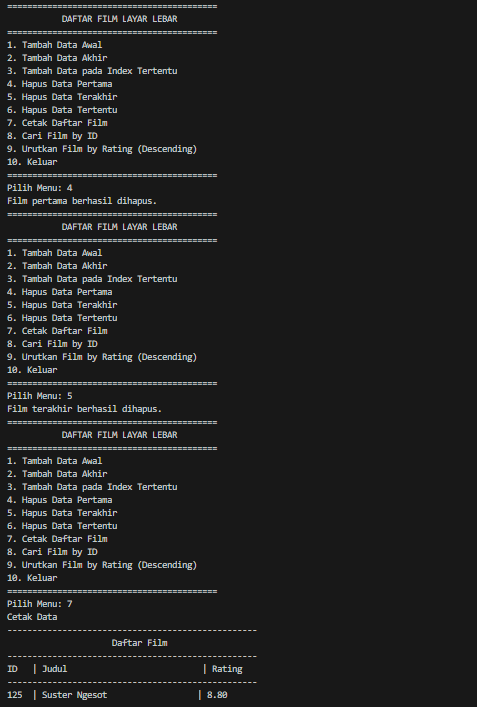
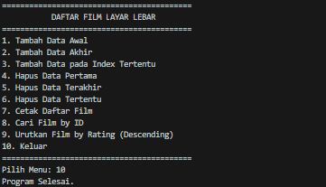

# Laporan Pertemuan 10
NIM: 2241760015

Nama: Oddis Nur Alifathur Razaaq

Kelas: SIB - 2C

# Doubly Linked List
## Praktikum 1
### Langkah - langkah Percobaan

- Node

- DoublyLinkedList

    

- Main

### Verifikasi Hasil Percobaan

### Pertanyaan
1. Jelaskan perbedaan antara single linked list dengan doubly linked lists!

Jawab: Perbedaan antara single linked list dan doubly linked list adalah bahwa single linked list memiliki setiap node yang hanya memiliki pointer ke node berikutnya, sementara doubly linked list memiliki setiap node dengan dua pointer, yaitu ke node sebelumnya (prev) dan node berikutnya (next).

2. Perhatikan class Node, di dalamnya terdapat atribut next dan prev. Untuk apakah atribut tersebut?

Jawab: Atribut next digunakan untuk menunjukkan node berikutnya dalam linked list, sementara atribut prev digunakan untuk menunjukkan node sebelumnya. Mereka digunakan untuk menghubungkan node-node dalam doubly linked list.

3. Perhatikan konstruktor pada class DoublyLinkedList. Apa kegunaan inisialisasi atribut head dan size?

Jawab: Inisialisasi atribut head digunakan untuk menunjukkan elemen pertama (node pertama) dalam linked list, dan inisialisasi atribut size digunakan untuk melacak jumlah elemen dalam linked list.

4. Pada method addFirst(), mengapa dalam pembuatan objek dari konstruktor class Node prev dianggap sama dengan null?

    head = new Node(null, data, null);

Jawab: Karena elemen baru ditambahkan di depan (head) linked list, sehingga tidak ada node sebelumnya.

5. Perhatikan pada method addFirst(). Apakah arti statement head.prev = newNode?

Jawab: Pernyataan head.prev = newNode dalam method addFirst() digunakan untuk menghubungkan node sebelumnya dari elemen sebelumnya (sekarang elemen kedua) ke elemen baru (elemen pertama).

6. Perhatikan isi method addLast(), apa arti dari pembuatan objek Node dengan mengisikan parameter prev dengan current, dan next dengan null?

    Node newNode = new Node(current, data, null);
    Pada method add()

Jawab: Pada method addLast(), pembuatan objek Node dengan parameter prev diisi dengan current dan parameter next diisi dengan null:
    - current adalah node terakhir dalam linked list sebelum penambahan elemen baru.
    - data adalah nilai data yang akan ditambahkan sebagai elemen baru di ujung belakang (tail) linked list.
    - null dalam parameter next menunjukkan bahwa elemen baru yang akan ditambahkan adalah elemen terakhir dalam linked list, sehingga tidak ada node setelahnya.
Artinya, dengan membuat elemen baru dengan prev diisi dengan current dan next diisi dengan null, kita sedang menambahkan elemen baru di ujung belakang linked list, dan elemen ini tidak memiliki node berikutnya karena ia adalah elemen terakhir. Selain itu, elemen baru akan memiliki hubungan dengan elemen terakhir (sekarang) yang akan menjadi node sebelumnya dari elemen baru, sehingga elemen sebelumnya (elemen terakhir sebelum penambahan) akan menunjuk ke elemen baru sebagai node berikutnya (next).

7. Pada method add(), terdapat potongan kode program sebagai berikut,

    if (current.prev == null) {
        Node newNode = new Node(null, data, current);
        current.prev = newNode;
        head = newNode;
    }

Jawab: Pada method add(), potongan kode program tersebut digunakan untuk menambahkan elemen baru di depan linked list (indeks 0). Jika node sebelumnya adalah null (karena ini adalah elemen pertama), maka elemen baru akan dihubungkan ke node pertama, dan head akan diperbarui untuk menunjuk ke elemen baru (sekarang elemen pertama).

## Praktikum 2
### Langkah - langkah Percobaan

- Node

- DoublyLinkedList

 

- Main

 

### Verifikasi Hasil Percobaan

### Pertanyaan
1. Apakah maksud statement berikut pada method removeFirst()?

    head = head.next;
    head.prev = null;

Jawab: Pada statement head = head.next;, ini menggantikan head dengan node berikutnya (node kedua) dalam linked list. Kemudian, head.prev = null; digunakan untuk memutuskan hubungan node sebelumnya dari elemen pertama yang sekarang, karena elemen pertama yang baru sekarang tidak memiliki node sebelumnya. Ini adalah langkah-langkah yang dilakukan dalam method removeFirst() untuk menghapus elemen pertama dari linked list.

2. Bagaimana cara mendeteksi posisi data ada pada bagian akhir pada method removeLast()?

Jawab: Posisi data di bagian akhir dalam method removeLast() dapat dideteksi dengan melalui kondisi while (current.next.next != null). Saat loop ini berjalan, current akan selalu mengarah ke node kedua terakhir dalam linked list. Jadi, jika current.next.next adalah null, maka current adalah node terakhir. Hal ini berarti bahwa kita telah mencapai elemen terakhir dalam linked list, dan elemen ini akan dihapus.

3. Jelaskan alasan mengapa potongan kode program di bawah ini tidak cocok untuk perintah remove!

    Node tmp = head.next;
    head.next = tmp.next;
    tmp.next.prev = head;

Jawab: Karena potongan kode program tersebut tidak memeriksa kasus saat menghapus elemen pertama atau elemen terakhir dari linked list. Saat menghapus elemen pertama, head akan menjadi null, dan saat menghapus elemen terakhir, potongan kode ini tidak mengatasi perubahan pada elemen terakhir dan node sebelumnya.

4. Jelaskan fungsi kode program berikut ini pada fungsi remove!

    current.prev.next = current.next;
    current.next.prev = current.prev;

Jawab: Berfungsi untuk menghapus elemen tengah dari linked list. Ini mengatur node sebelumnya (prev) untuk menunjuk ke node berikutnya (next), dan sebaliknya, sehingga elemen di tengah dihapus dengan cara mengubah pointer dari node sebelumnya dan node berikutnya.

## Praktikum 3
### Langkah - langkah Percobaan

- Node

- DoublyLinkedList

   

- Main

 

### Verifikasi Hasil Percobaan

### Pertanyaan
1. Jelaskan method size() pada class DoublyLinkedList!

Jawab: Method size() pada class DoublyLinkedList adalah sebuah method yang digunakan untuk mengembalikan jumlah elemen (node) dalam doubly linked list. Method ini mengambil nilai dari atribut size yang merupakan jumlah elemen saat ini dalam linked list dan mengembalikannya sebagai hasil.

2. Jelaskan cara mengatur indeks pada doubly linked lists supaya dapat dimulai dari indeks ke-1!

Jawab: Untuk mengatur indeks pada doubly linked list agar dimulai dari indeks ke-1, kita perlu mengubah logika dalam method get(int index) dan cara mengelola indeks. Dalam struktur data umum, indeks biasanya dimulai dari 0, tetapi kita dapat dengan mudah mengubahnya dimulai dari 1 seperti yang diinginkan.

3. Jelaskan perbedaan karakteristik fungsi Add pada doubly linked list dan single linked list!

Jawab:

- Doubly Linked List:
    a. Dapat menambah dan menghapus elemen di kedua ujung list (depan dan belakang) dengan efisiensi konstan O(1).
    b. Lebih fleksibel dalam operasi-operasi yang memerlukan akses ke node sebelumnya karena memiliki pointer ke node sebelumnya (prev).
    c. Memiliki dua pointer per node, yaitu prev dan next.

Sedangkan

- Single Linked List:
    a. Lebih efisien dalam menambah atau menghapus elemen di ujung belakang (tail) dengan efisiensi konstan O(1).
    b. Kurang efisien dalam menambah atau menghapus elemen di depan (head) atau di tengah  list karena memerlukan pencarian node sebelumnya, yang memerlukan waktu O(n) dalam kasus terburuk.
    c. Hanya memiliki satu pointer ke depan (next) per node.

4. Jelaskan perbedaan logika dari kedua kode program di bawah ini!
Kode 1
    public boolean isEmpty() {
        if(size==0) {
            return true;
        } else {
            return false;
        }
    }

Kode 2
    public boolean isEmpty() {
    return head == null;
    }

Jawab:

- Kode 1 menggunakan ekspresi kondisional if-else untuk memeriksa apakah nilai atribut size adalah 0 atau tidak. Jika size sama dengan 0, maka method mengembalikan true yang berarti linked list kosong, dan jika tidak, method mengembalikan false. Ini adalah pendekatan eksplisit.
- Sedangkan kode 2 menggunakan ekspresi return head == null; untuk memeriksa apakah atribut head adalah null atau tidak. Jika head adalah null, maka method langsung mengembalikan true, dan jika head tidak null, method langsung mengembalikan false. Pendekatan ini lebih sederhana

## Tugas
1. Buat program antrian vaksinasi menggunakan queue berbasis doubly linked list sesuai ilustrasi dan menu di bawah ini! (counter jumlah antrian tersisa di menu cetak(3) dan data orang yang telah divaksinasi di menu Hapus Data(2) harus ada)

- Node

- DoublyLinkedList

- Main

- Hasil

2. Buatlah program daftar film yang terdiri dari id, judul dan rating menggunakan doubly linked lists, bentuk program memiliki fitur pencarian melalui ID Film dan pengurutan Rating secara descending. Class Film wajib diimplementasikan dalam soal ini.

- NodeFilm

- DoublyLinkedList

- Main

- Hasil

