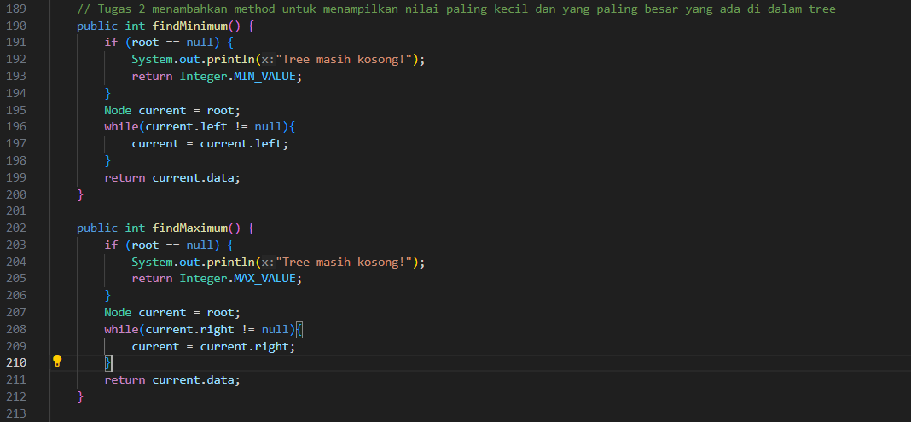
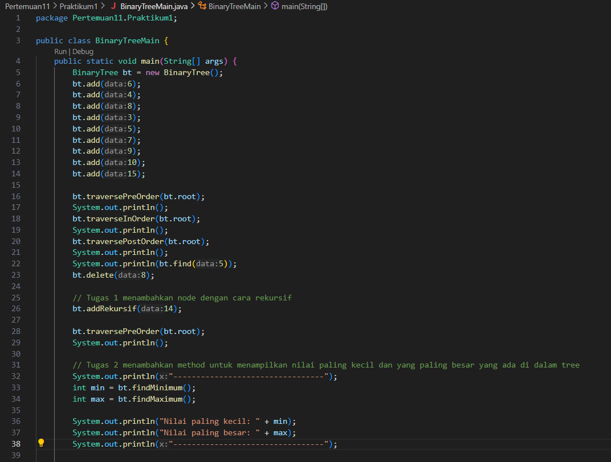
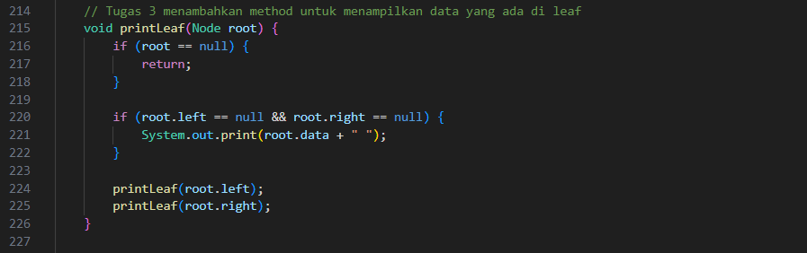
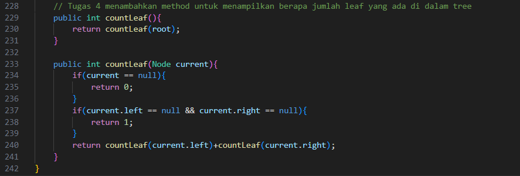

# Laporan Pertemuan 11

NIM: 2241760015

Nama: Oddis Nur Alifathur Razaaq

Kelas: SIB - 2C

# Tree
## Praktikum 1
### Langkah - langkah Percobaan

- Node

- BinaryTree

- BinaryTreeMain

### Verifikasi Hasil Percobaan

### Pertanyaan
1. Mengapa dalam binary search tree proses pencarian data bisa lebih efektif dilakukan dibanding binary tree biasa?

Jawab: Karena pada binary search tree (BST) memiliki struktur yang lebih teratur dan terorganisir dibandingkan dengan binary tree biasa. Pada binary search tree (BST), setiap simpul memiliki nilai kunci yang membedakan dengan nilai kunci dari simpul lainnya. Dengan adanya urutan kunci ini proses pencarian data dapat menjadi lebih efektif, karena dapat mengeliminasi sebagian besar cabang yang tidak perlu dicek

2. Apa fungsi atribut left dan right pada class Node?

Jawab: Atribut left dan right pada class Node digunakan untuk menghubungkan node-node dalam pohon. Atribut "left" dan "right" pada class Node juga mengacu pada anak kiri dan anak kanan suatu simpul (node)

- Atribut left: Menunjukkan pada node anak kiri dari node saat ini.

- Atribut right: Menunjukkan pada node anak kanan dari node saat ini.

3. Simak pertanyaan berikut,

    1. Apa kegunaan dari atribut root di dalam class BinaryTree?

    Jawab: Atribut "root" dalam class BinaryTree digunakan untuk menyimpan referensi ke simpul akar (root) dari pohon biner. Simpul akar merupakan simpul paling atas dalam suatu struktur pohon dan merupakan titik awal untuk mengakses seluruh pohon.

    2. Ketika objek tree pertama kali dibuat, apa nilai dari root?

    Jawab: Ketika objek tree pertama kali dibuat nilai root adalah null atau kosong(root==null), yang merupakan kondisi awal ketika pohon belum memiliki simpul (pohon masih kosong).

    Kode:
    public BinaryTree() {
        root = null;
    }

4. Ketika tree masih kosong, dan akan ditambahkan sebuah node baru, proses apa yang akan terjadi?

Jawab: Ketika pohon (tree) masih kosong dan ingin menambahkan sebuah node baru, proses yang terjadi adalah node baru akan dibuat dengan data yang sesuai, dan jika pohon masih kosong (root == null), maka node baru akan diatur sebagai root (akar) dari pohon.

5. Perhatikan method add(), di dalamnya terdapat baris program seperti di bawah ini. Jelaskan secara detil untuk apa baris program tersebut?
    if(data < current.data) {
        if(current.left != null) {
            current = current.left;
        } else {
            current.left = new Node(data);
            break;
        }
    }

Jawab: Program tersebut digunakan untuk menentukan posisi penambahan simpul baru berdasarkan perbandingan nilai data dengan nilai pada simpul saat ini. Jika nilai data lebih kecil, program akan pindah ke simpul anak kiri jika ada, jika tidak, akan menambahkan simpul baru sebagai anak kiri simpul saat ini. Dengan demikian, baris program tersebut mengatur struktur Binary Search Tree agar tetap terurut.

## Praktikum 2
### Langkah - langkah Percobaan

- BinaryTreeArray

- BinaryTreeArrayMain

### Verifikasi Hasil Percobaan

### Pertanyaan
1. Apakah kegunaan dari atribut data dan idxLast yang ada di class BinaryTreeArray?

Jawab:

- Atribut "data" adalah array yang digunakan untuk menyimpan data yang akan dibentuk menjadi pohon biner. Setiap elemen dalam array ini akan menjadi simpul dalam pohon biner.

- Atribut "idxLast" adalah indeks yang digunakan untuk menunjukkan indeks terakhir dari data yang digunakan dalam pohon biner. Ini menunjukkan indeks terakhir dalam array "data" yang digunakan untuk membangun pohon. Indeks ini juga digunakan untuk mengidentifikasi elemen terakhir yang valid dalam array yang akan digunakan dalam pohon biner.

2. Apakah kegunaan dari method populateData()?

Jawab: Method populateData() digunakan untuk mengisi data dan mengatur indeks terakhir pada objek BinaryTreeArray. Sehingga dapat menginisialisasi pohon biner array dengan data yang sudah ada.

3. Apakah kegunaan dari method traverseInOrder()?

Jawab: Method traverseInOrder() digunakan untuk melakukan penelusuran (traversal) pohon biner array secara in-order. Pertama, method ini mengunjungi simpul anak kiri, kemudian mengunjungi simpul saat ini, dan terakhir mengunjungi simpul anak kanan. Ini membantu dalam mencetak atau menampilkan data dalam pohon biner array secara in-order, yang sesuai dengan urutan.

4. Jika suatu node binary tree disimpan dalam array indeks 2, maka di indeks berapakah posisi left child dan rigth child masing-masing?

Jawab: Jika suatu node dalam binary tree disimpan pada indeks 2 dalam sebuah array, maka:
- Posisi left child (anak kiri) akan berada pada indeks 2 * 2 + 1 = 5.
- Posisi right child (anak kanan) akan berada pada indeks 2 * 2 + 2 = 6.

Hal ini berlaku dalam representasi array dari binary tree di mana indeks dimulai dari 0.

5. Apa kegunaan statement int idxLast = 6 pada praktikum 2 percobaan nomor 4?

Jawab: Statement int idxLast = 6 digunakan untuk mengatur nilai idxLast pada objek BinaryTreeArray. Nilai idxLast menunjukkan indeks terakhir yang valid dalam array data yang akan digunakan dalam pohon biner array. Dengan mengatur idxLast ke nilai 6, ini membatasi data yang akan digunakan dalam pohon biner array hingga indeks 6 (0 sampai 6), dan elemen-elemen di luar indeks ini dianggap kosong atau null. Sehingga dapat mengendalikan data yang digunakan dalam struktur pohon biner array sesuai dengan kebutuhan.

## Tugas
1. Buat method di dalam class BinaryTree yang akan menambahkan node dengan cara rekursif.

Jawab:

- Penambahan method pada class BinaryTree pada praktikum1

- Main

- Hasil

2. Buat method di dalam class BinaryTree untuk menampilkan nilai paling kecil dan yang paling besar yang ada di dalam tree.

Jawab:

- Penambahan method pada class BinaryTree pada praktikum1

- Main

- Hasil

3. Buat method di dalam class BinaryTree untuk menampilkan data yang ada di leaf.

Jawab:

- Penambahan method pada class BinaryTree pada praktikum1

- Main

- Hasil

4. Buat method di dalam class BinaryTree untuk menampilkan berapa jumlah leaf yang ada di dalam tree.

Jawab: 

- Penambahan method pada class BinaryTree pada praktikum1

- Main

- Hasil

5. Modifikasi class BinaryTreeArray, dan tambahkan : 
    1. method add(int data) untuk memasukan data ke dalam tree 
    2. method traversePreOrder() dan traversePostOrder().

Jawab:

- Penambahan method pada class BinaryTreeArray pada praktikum2

- Main

- Hasil

