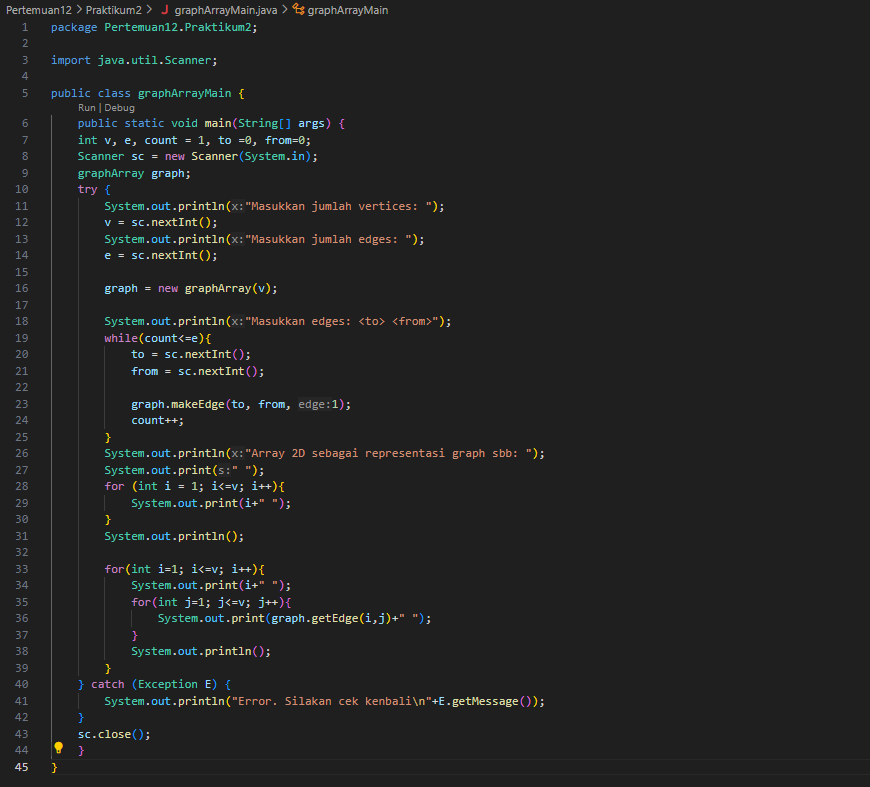
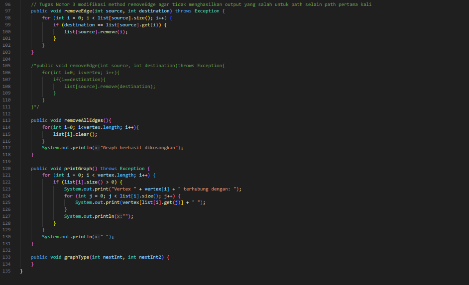

# Laporan Pertemuan 12

NIM: 2241760015

Nama: Oddis Nur Alifathur Razaaq

Kelas: SIB - 2C

# GRAPH
## Praktikum 1
### Langkah - langkah Percobaan

- Node

- Linked List

- Graph

- Graph Main

### Verifikasi Hasil Percobaan

- Hasil running pada langkah ke-11

- Hasil running pada langkah ke-13

### Pertanyaan
1. Sebutkan beberapa jeni (minimal 3) algoritma yang menggunakan dasar Graph, dan apakah kegunaan algoritma-algoritma tersebut?

Jawab: 

    1. Algoritma Dijkstra: Digunakan untuk mencari jalur terpendek antara dua simpul pada graf berbobot positif.
    2. Algoritma Breadth-First Search (BFS): Digunakan untuk pencarian level per level dari sebuah simpul pada graf.
    3. Algoritma Depth-First Search (DFS): Digunakan untuk traversal atau penelusuran struktur graf secara rekursif.

2. Pada class Graph terdapat array bertipe LinkedList, yaitu LinkedList list[]. Apakah tujuan pembuatan variabel tersebut ?

Jawab:  Variabel array bertipe LinkedList list[] pada class Graph digunakan untuk merepresentasikan graf menggunakan representasi adjacency list. Setiap elemen dalam array merepresentasikan simpul (node) graf, dan LinkedList digunakan untuk menyimpan simpul-simpul yang terhubung dengan simpul tersebut.

3. Apakah alasan pemanggilan method addFirst() untuk menambahkan data, bukan method add jenis lain pada linked list ketika digunakan pada method addEdge pada class Graph?

Jawab: Pemanggilan method addFirst() digunakan pada method addEdge() pada class Graph untuk menambahkan data ke LinkedList yang merepresentasikan graf. Karena method tersebut adalah representasi adjacency list, penambahan vertex baru dihubungkan dengan vertex lain melalui urutan pertama (head) dari linked list tersebut.

4. Bagaimana cara mendeteksi prev pointer pada saat akan melakukan penghapusan suatu edge pada graph ?

Jawab: Saat akan melakukan penghapusan suatu edge pada graph, prev pointer dapat dideteksi dengan melakukan traversal pada linked list yang merepresentasikan graf. Misalnya, untuk menghapus edge antara simpul A dan simpul B, maka dapat dilihat apakah simpul B terdapat pada LinkedList yang terhubung dengan simpul A. Jika iya, maka prev pointer adalah simpul A.

5. Kenapa pada praktikum 12.2 langkah ke-12 untuk menghapus path yang bukan merupakan lintasan pertama kali menghasilkan output yang salah ?  Bagaimana solusinya ?

Jawab: Tidak salah, hanya saja pada praktikum langkah ke-12 yang dipanggil adalah graph.removeEdge(1, 2); bukan
graph.removeEdge(1, 3); Jadi, kesalahannya pada soal bukan pada output.

## Praktikum 2
### Langkah - langkah Percobaan

- GraphArray

- GraphArrayMain

### Verifikasi Hasil Percobaan

- Hasil running pada langkah ke-11

### Pertanyaan
1. Apakah perbedaan degree/derajat pada directed dan undirected graph?

Jawab:

- Pada undirected graph, derajat dari suatu node/simpul adalah jumlah edge yang terhubung ke simpul tersebut. Sedangkan
- Pada directed graph, degree node/simpul terbagi menjadi dua jenis: in-degree (jumlah edge yang menuju ke simpul tersebut) dan out-degree (jumlah edge yang keluar dari simpul tersebut).

2. Pada implementasi graph menggunakan adjacency matriks. Kenapa jumlah vertices harus ditambahkan dengan 1 pada indeks array berikut?

    public graphArray(int v) {
            vertices = v;
            twoD_array = new int[vertices + 1][vertices + 1];
        }

Jawab: Indeks array dimulai dari 0, kode diatas jumlah vertices harus ditambahkan dengan  1biasanya ketika merepresentasikan simpul dalam graf, nomor simpul dimulai dari 1. Oleh karena itu, jumlah vertices ditambahkan dengan 1 pada pembuatan array indeks untuk menyimpan informasi hubungan antara simpul 1 hingga simpul yang ke-v.

3. Apakah kegunaan method getEdge() ?

Jawab: Digunakan untuk mendapatkan nilai bobot atau informasi edge antara dua simpul dalam graf yang direpresentasikan oleh adjacency matriks. Nilai bobot digunakan sebagai 1 untuk menunjukkan adanya koneksi antara dua simpul.

4. Termasuk jenis graph apakah uji coba pada praktikum 12.3 ?

Jawab: Termasuk jenis Directed Graph karena 1 berhubungan dengan 2 akan tetapi 2 tidak berhubungan 
dengan 1

5. Mengapa pada method main harus menggunakan try-catch Exception ?

Jawab: Try-catch Exception digunakan untuk menangani kemungkinan error atau pengecualian (exception) yang dapat terjadi saat pengguna memasukkan input atau saat proses pembuatan objek graph. Hal ini membantu program agar tidak berhenti secara tiba-tiba akibat error saat menjalankan program.

## Tugas
1. Ubahlah lintasan pada praktikum 12.2 menjadi inputan!

Jawab:

- Mengubah lintasan menjadi inputan pada class GraphMain

- Hasilnya

2. Tambahkan method graphType dengan tipe boolean yang akan membedakan graph termasuk directed atau undirected graph. Kemudian update seluruh method yang berelasi dengan method graphType tersebut (hanya menjalankan statement sesuai dengan jenis graph) pada praktikum 12.2

Jawab:

- Menambahkan method graphType dengan tipe boolean yang akan membedakan graph termasuk directed atau undirected graph pada class Graph

- Main

- Hasil

3. Modifikasi method removeEdge() pada praktikum 12.2 agar tidak menghasilkan output yang salah untuk path selain path pertama kali!

Jawab:

- Memodifikasi method removeEdge() di class Graph

- Main

- Hasil

4. Ubahlah tipe data vertex pada seluruh graph pada praktikum 12.2 dan 12.3 dari Integer menjadi tipe generic agar dapat menerima semua tipe data dasar Java! Misalnya setiap vertex yang awalnya berupa angka 0,1,2 3, dst. selanjutnya ubah menjadi suatu nama daerah seperti Malang, Surabaya, Gresik, Bandung, dst.

Jawab:

- Praktikum 1

    - Mengubah tipe data vertex pada class graph

    

    

    - Main

    

    - Hasil

    

- Praktikum 2

    - Mengubah tipe data vertex pada class graphArray

    

    - Main

    

    - Hasil

    