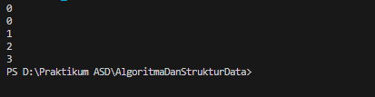

# Laporan Pertemuan 14

NIM: 2241760015

Nama: Oddis Nur Alifathur Razaaq

Kelas: SIB - 2C

# Praktikum HashTable
## Praktikum 1
### Langkah - langkah Percobaan

- HashTable

- HashTableMain

- Verifikasi Hasil Percobaan

- Menambahkan method set() yang digunakan untuk menambakan data pada hash table.

- Menambahkan data pada kelas HashTableMain kemudian mencetak hasil penambahan data dengan method printTable().

- Verifikasi Hasil Percobaan kembali

- Menambahkan method get() untuk mendapatkan data berdasarkan key pada hash table.

- Menambahkan kode pada main class untuk memastikan apakah method get() berjalan dengan baik.

- Verifikasi Hasil Percobaan kembali

- Menambah method keys() pada hash table untuk mendapatkan semua key pada struktur data hash table. Method ini akan menggunakan ArrayList untuk menyimpan key.

- Menambahkan kode pada main class untuk mengetahui apakah method keys() dapat berkeja dengan baik.

- Verifikasi Hasil Percobaan kembali

### Pertanyaan
1. Apa keunggulan penanganan collision menggunakan metode separate chaining dibandingkan dengan motode linear probing?

Jawab: Keunggulan Metode separate chaining dibandingkan linear probing dalam menangani collision pada hash table antara lain:

    - Kinerja yang lebih baik pada tabel hash saat tabel hampir penuh: Separate chaining tetap efisien saat tabel hash hampir penuh, sedangkan linear probing cenderung mengalami penurunan kinerja.

    - Menghindari clustering: Separate chaining mengurangi kemungkinan terjadinya clustering (penumpukan elemen) yang bisa menghambat kinerja, yang sering terjadi pada linear probing.

    - Kemudahan dalam penghapusan elemen: Lebih mudah menghapus elemen dalam separate chaining tanpa mengganggu elemen lainnya, sedangkan linear probing lebih rumit dalam penghapusan.

2. Apa maksud dari potongan kode berikut pada method hash()?

    int hash = 0;
    for (int i = 0; i < key.length(); i++) {
        hash = (hash + key.charAt(i) * i) % this.dataMap.length;
    }

Jawab: Potongan kode pada method hash() adalah algoritma untuk menghasilkan nilai hash dari sebuah string key. Looping dilakukan sepanjang panjang key, dan setiap karakter dari key diambil untuk dijumlahkan dengan indeksnya (i) dikali dengan nilai ASCII dari karakter tersebut. Nilai hasil penjumlahan tersebut kemudian dimodulo dengan panjang dari dataMap (jumlah slot pada tabel hash) untuk mendapatkan indeks hash.

3. Apa maksud dari potongan kode berikut pada method set()?

    else {
        Node current = this.dataMap[hash];
        if(current.key == key) {
            current.value += value;
            return;
        }
        while (current.next != null) {
            current = current.next;
            if(current.key == key) {
                current.value += value;
                return;
            }
        }
        current.next = newNode;
    }

Jawab: Potongan kode pada method set() digunakan untuk menambahkan data baru ke dalam hash table. Jika slot kosong pada dataMap[hash], maka newNode (node baru) akan langsung ditempatkan di sana. Jika tidak kosong, maka dilakukan pengecekan pada node yang ada. Jika current.key sama dengan key yang baru dimasukkan, maka nilai current.value akan ditambah dengan nilai value yang baru. Jika tidak ada node dengan key yang sama pada slot tersebut, maka dilakukan pencarian ke node selanjutnya dengan menggunakan linked list. Jika ditemukan node dengan key yang sama, nilai value akan diupdate; jika tidak ditemukan, node baru akan ditambahkan di akhir linked list pada slot tersebut.

4. Buatlah method remove() untuk menghapus data berdasarkan key.

Jawab:

- Kode method yang saya buat

- Kode pengujian methodnya di main

- Hasil

## Tugas
- Implementasikan kasus berikut dengan menggunakan hash table.
    - Buatlah objek Mahasiswa dengan atribut sebagai berikut,
        - NIM
        - Nama Lengkap
        - Jurusan
        - Program Studi

Jawab:

- Kode class Mahasiswa

- Buatlah kelas HashTable yang dapat menyimpan objek Mahasiswa dengan spesifikasi,
    - Key --> NIM mahasiswa
    - Value --> Objek Mahasiswa
    - Dapat menambahkan data mahasiswa dengan menggunakan inputan.
    - Dapat mencari mahasiswa berdasarkan NIM.
    - Dapat menghapus mahasiswa.
    - Dapat menampilkan seluruh NIM mahasiswa yang telah tersimpan.

Jawab:

- Kode class HashTable

- Main

- Hasil

