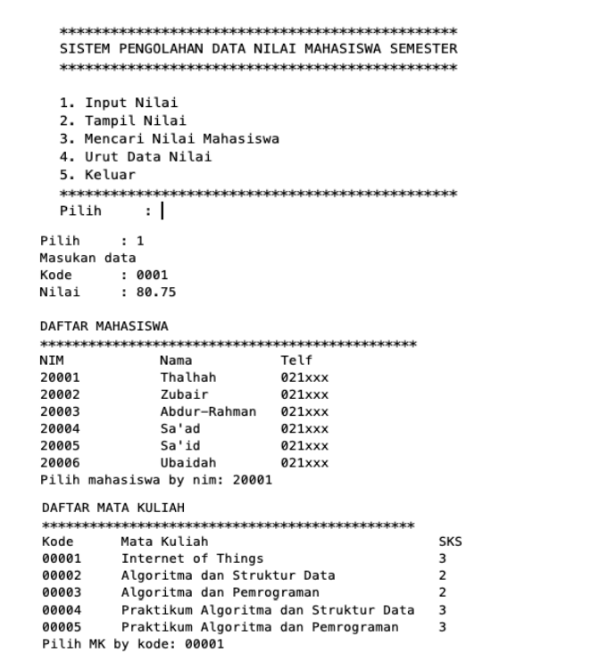
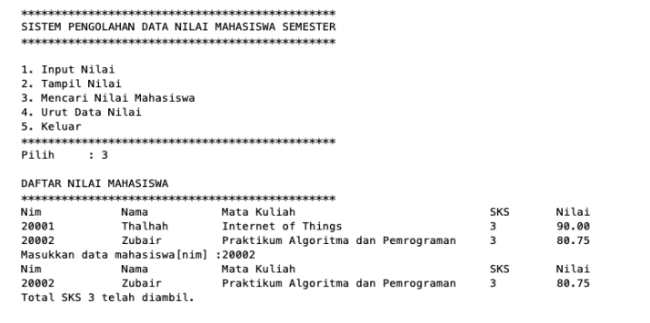
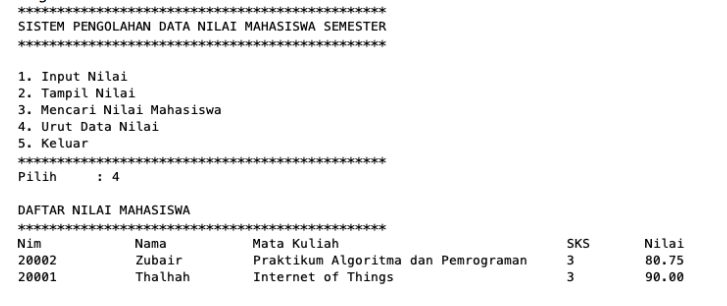

# Laporan Pertemuan 16

## NIM: 2241760015

## Nama: Oddis Nur Alifathur Razaaq

## Kelas: SIB - 2C

# Jobsheet Collection

## 16.2. Praktikum 1
### 16.2.1 Percobaan 1
Pada percobaan 1 ini akan dicontohkan penggunaan collection untuk menambahkan sebuah elemen, mengakses elemen, dan menghapus sebuah elemen.

- Kode Class ContohList

### 16.2.2 Verifikasi Hasil Percobaan

### 16.2.3 Pertanyaan Percobaan
1. Perhatikan baris kode 25-36, mengapa semua jenis data bisa ditampung ke dalam sebuah Arraylist?

Jawab: Karena pada baris kode 25-36 ArrayList  bersifat sintak umum yang dapat menyimpan
data segala jenis tipe data. Karena arrayList tersebut tidak terdapat kurung sudut yang
menyimpan secara spesifik data yang akan disimpan didalamnya.

2. Modifikasi baris kode 25-36 seingga data yang ditampung hanya satu jenis atau spesifik tipe tertentu!

Jawab:

3. Ubah kode pada baris kode 38 menjadi seperti ini

Jawab:

4. Tambahkan juga baris berikut ini, untuk memberikan perbedaan dari tampilan yang sebelumnya

Jawab:

5. Dari penambahan kode tersebut, silakan dijalankan dan apakah yang dapat Anda jelaskan!

Jawab:

Dari perubahan kode diatas artinya kita dapat memberikan batas tipe data yang akan dimasukkan dengan perintah, dengan
menggunakan class LinkedList kita bisa menggunakan method-method LinkedListseperti push(), getFirst(), getLast(), akan tetapi ketika menggunakan class List tidak bisa. Fungsi push() pada collection akan menambahkan data pada index ke 0. Jadi nanti mei-mei akan berada di index-0.

## 16.3. Praktikum 2
### 16.3.1 Tahap Percobaan
Pada praktikum 2 ini akan dibuat beberapa method untuk menampilkan beberapa cara yang dapat dilakukan untuk mengambil/menampilkan elemen pada sebuah collection.

- Kode Class LoopCollection

### 16.3.2 Verifikasi Hasil Percobaan

### 16.3.3 Pertanyaan Percobaan
1. Apakah perbedaan fungsi push() dan add() pada objek fruits?

Jawab: Perbedaan ada di peletakkan item/elemen. Jika push() terletak pada bagian depan/atas, sedangkan add() terletak pada bagian terakhir. Dan juga Pada push() merupakan fungsi dari interface stack, sedangkan add() tidak atau bukan interface dari stack.

2. Silakan hilangkan baris 43 dan 44, apakah yang akan terjadi? Mengapa bisa demikian?

Jawab:

- Kode

- Hasil

Alasan: Data tersebut tidak muncul karena baris yang menambahkan "Melon" dan "Durian" ke dalam stack telah dihilangkan atau saya jadikan komentar. Sehingga, walaupun operasi push() dimaksudkan untuk menambahkan "Melon" dan "Durian" ke dalam stack, karena baris tersebut dijadikan komentar, operasi ini tidak dijalankan. Oleh karena itu, data "melon" dan "durian" tidak muncul saat di run.

3. Jelaskan fungsi dari baris 46-49?

Jawab: Kode pada baris 46-49 berfungsi untuk mengiterasi elemen-elemen dalam koleksi fruits menggunakan iterator, dan mencetak setiap elemen ke output.
Pada baris 46: Baris kode ini akan menginisialisasi iterator it dengan menggunakan metode iterator() dari objek fruits.
Pada baris 47: Baris kode ini akan mengambil elemen berikutnya dari koleksi fruits menggunakan metode next() dari iterator it.
Pada baris 48: Baris kode ini akan mencetak elemen yang diambil dari baris 47 ke output.

4. Silakan ganti baris kode 25, Stack<String> menjadi List<String> dan apakah yang terjadi? Mengapa bisa demikian?

Jawab:

Alasan: Eror pada bagian push, empty, pop karena tidak dapat dijalankan pada interface list, yang mana perintah diatas adalah fungsi dari interface stack

5. Ganti elemen terakhir dari dari objek fruits menjadi “Strawberry”!

Jawab:

- Kode

- Hasil

6. Tambahkan 3 buah seperti “Mango”,”guava”, dan “avocado” kemudian dilakukan sorting!

Jawab:

- Kode

- Hasil

## 16.4. Praktikum 3
### 16.4.1 Tahap Percobaan
Pada praktikum 3 ini dilakukan uji coba untuk mengimplementasikan sebuah collection untuk menampung objek yang dibuat sesuai kebutuhan. Objek tersebut adalah sebuah objek mahasiswa dengan fungsi-fungsi umum seperti menambahkan, menghapus, mengubah, dan mencari.

- Kode Class Mahasiswa

- Kode Class ListMahasiswa

### 16.4.2 Verifikasi Hasil Percobaan

### 16.4.3 Pertanyaan Percobaan
1. Pada fungsi tambah() yang menggunakan unlimited argument itu menggunakan konsep apa Dan kelebihannya apa?

Jawab:  Pada fungsi tambah() yang menggunakan unlimited argument menggunakan konsep varargs (variable arguments) dalam bahasa pemrograman Java. Varargs memungkinkan sebuah fungsi menerima sejumlah argumen yang tidak terbatas pada saat pemanggilan. Dan kelebihannya adalah kode lebih efisien dan tidak memanggil metode berulang ulang.

2. Pada fungsi linearSearch() di atas, silakan diganti dengan fungsi binarySearch() dari collection!

Jawab:

- Kode

- Hasil

3. Tambahkan fungsi sorting baik secara ascending ataupun descending pada class tersebut!

Jawab:

- Kode

- Hasil

## 16.5. Praktikum 4
### 16.5.1 Hashtable

A. Kode Hashtable secara procedural

B. Kode Hashtable dengan pendekatan OOP

### 16.5.2 Heap

- Kode Class Node

- Kode Class Heap

- Kode Class MinHeap

- Kode Class MaxHeap

- Kode Class Main

### 16.5.3 Verifikasi Hasil Percobaan

## Tugas
1. Buatlah implementasi program daftar nilai mahasiswa semester, minimal memiliki 3 class yaitu Mahasiswa, Nilai, dan Mata Kuliah. Data Mahasiswa dan Mata Kuliah perlu melalui penginputan data terlebih dahulu

Ilustrasi Program

Menu Awal dan Penambahan Data

Tampil Nilai

Pencarian Data Mahasiswa

Pengurutan Data Nilai

Jawab:

- Kode Class Mahasiswa

- Kode Class Mata Kuliah

- Kode Class Nilai

- Hasil

2. Tambahkan prosedur hapus data mahasiswa melalui implementasi Queue pada collections Tugas nomor 1!

Jawab:

- Menambahkan prosedur hapus data mahasiswa melalui implementasi Queue pada collections pada Kode Class Nilai

- Hasil