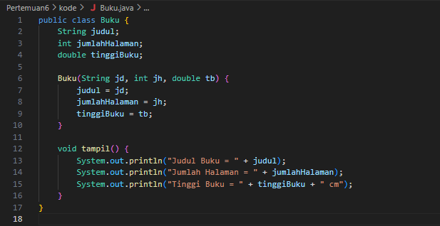

# Laporan Pertemuan 6
NIM: 2241760015

Nama: Oddis Nur Alifathur Razaaq

Kelas: SIB-2C

# Jobsheet 5
## 5. 2 Mengimplementasikan Sorting menggunakan Object
### 5.2.1 Langkah Praktikum 1

SORTING – BUBBLE SORT
- 

- 

### 5.2.2 Verifikasi Hasil Percobaan

SORTING – SELECTION SORT

- 

- 

### 5.2.3 Verifikasi Hasil Percobaan

### 5.2.4 Pertanyaan!

1. Jelaskan maksud dari kode berikut

    Sort urut=new Sort(a, a.length);

Jawab:

    a. Sort adalah nama kelas yang didefinisikan sebelumnya. Dalam baris ini, kita membuat objek baru dari kelas Sort dan menamainya urut. Ini adalah cara untuk membuat instance (objek) dari suatu kelas di Java.

    b. new Sort(a, a.length) adalah bagian yang menciptakan objek urut.

        - new digunakan untuk mengalokasikan memori dan membuat objek baru.
        - Sort(a, a.length) adalah pemanggilan konstruktor dari kelas Sort.
        - a adalah array integer yang telah didefinisikan sebelumnya dengan isi {15, 10, 7, 22, 5}.
        - a.length adalah panjang (jumlah elemen) dari array a, yang dalam kasus ini adalah 5. Jadi, nilai a.length digunakan sebagai argumen kedua untuk konstruktor Sort, yang menyatakan jumlah data dalam array.

    Jadi, baris kode ini bermaksud untuk menciptakan objek urut dari kelas Sort dengan menggunakan array a sebagai data dan panjang array a sebagai jumlah data. Objek urut kemudian dapat digunakan untuk memanggil metode-metode yang ada dalam kelas Sort, seperti bubbleSort(), selecionSort(), dan tampilData() untuk melakukan pengurutan dan menampilkan data.

2. Jelaskan fungsi kode program berikut

    temp=data[j];
    data[j]=data[j-1];
    data[j-1]=temp;

Jawab:

    a. temp = data[j];: Di sini, nilai dari elemen data[j] (elemen saat ini yang sedang dibandingkan dengan elemen sebelumnya) disimpan dalam variabel sementara temp. Ini dilakukan untuk memindahkan nilai dari data[j] agar tidak hilang ketika dilakukan pertukaran dengan elemen sebelumnya.

    b. data[j] = data[j-1];: Nilai elemen data[j] diperbarui dengan nilai dari elemen sebelumnya, yaitu data[j-1]. Dengan kata lain, nilai dari elemen saat ini (data[j]) digantikan dengan nilai elemen sebelumnya (data[j-1]).

    c. data[j-1] = temp;: Nilai elemen sebelumnya (data[j-1]) diperbarui dengan nilai yang disimpan dalam variabel temp. Ini adalah langkah terakhir yang melibatkan pertukaran nilai, dan sekarang elemen yang lebih kecil telah bergerak ke atas menuju posisi yang benar dalam urutan yang diurutkan.

3. Tunjukkan kode program yang merupakan algoritma pencarian nilai minimum pada selection sort!

Jawab:

    Kode yang menunjukkan algoritma pencarian nilai minimun:

    int temp=data[i];
    data[i]=data[min];
    data[min]=temp;

4. Kerjakan kembali program pengurutan menggunakan algoritma bublle sort dan SelectionSort di atas dengan pengurutan secara DESC!

Jawab:

- 

- 

- Hasil

## 5.3 Langkah Praktikum 2 (Menggunakan Array of Object)
### 5.3.1 Membuat Class Mahasiswa

### 5.3.2 Membuat Class DaftarMahasiswaBerprestas

### 5.3.3 Membuat Class Main

- Main mahasiswa sebelum sorting

- Hasil sebelum sorting

- Main mahasiswa setelah ditambahi sorting DESC berdasarkan ipk

### 5.3.4 Verifikasi Hasil Percobaan
- 

### 5.3.5 Menambahkan Proses Selection Sort di dalam Class DaftarMahasiswaBerprestasi

- Menambahkan method selectionSort() di dalam class DaftarMahasiswaBerprestasi

- Menambahkan baris program untuk memanggil method selectionSort() di dalam class MainMahasiswa

- Hasil setelah penambahan selectionSort() atau ASC

### 5.3.6 Pertanyaan

1. Tunjukkan proses pencarian nilai minimum pada algoritma Selection Sort yang telah dipraktikkan pada pertemuan ini (bukti screen shoot kode program dan penjelasan)!

Jawab: 

Bukti kode:

    for(int i=0; i<listMhs.length-1; i++){
        int idxMin = i;
        for(int j=i+1; j<listMhs.length; j++){
            if(listMhs[j].ipk < listMhs[idxMin].ipk){
                idxMin = j;
            }
        }

        // Swap
        Mahasiswa tmp = listMhs[idxMin];
        listMhs[idxMin] = listMhs[i];
        listMhs[i] = tmp;
    }

Penjelasan: 
    Dalam proses pencarian nilai minimum pada algoritma Selection Sort yang telah dipraktikkan, kita memiliki dua perulangan bersarang. Perulangan pertama digunakan untuk mengiterasi melalui elemen-elemen array. Perulangan kedua digunakan untuk mencari nilai minimum dalam array.

        a. Pada awal setiap iterasi perulangan pertama, kita menginisialisasi idxMin dengan nilai i, yang merupakan indeks saat ini dalam iterasi.
        Perulangan kedua berjalan dari i+1 hingga akhir array, membandingkan nilai IPK pada listMhs[j] dengan nilai IPK pada listMhs[idxMin] (nilai minimum yang saat ini diketahui).

        b. Jika nilai IPK pada listMhs[j] lebih kecil dari nilai IPK pada listMhs[idxMin], maka kita memperbarui idxMin dengan j, yang merupakan indeks elemen dengan nilai minimum yang baru ditemukan.

        c. Setelah selesai mencari nilai minimum dalam perulangan kedua, kita menukar elemen yang memiliki nilai minimum (listMhs[idxMin]) dengan elemen yang berada pada indeks saat ini dalam perulangan pertama (listMhs[i]). Ini dilakukan untuk menyusun elemen-elemen secara berurutan berdasarkan nilai IPK, sehingga nilai minimum berada di posisi yang benar.

        d. Proses ini terus berlanjut hingga seluruh array terurut dengan benar berdasarkan nilai IPK, dari nilai terkecil ke terbesar.

    Sehingga dengan algoritma Selection Sort ini, kita mengurutkan elemen-elemen dalam array dengan mencari nilai minimum pada setiap iterasi dan menukar posisi elemen-elemen yang sesuai. Proses ini berlanjut hingga seluruh array terurut berdasarkan nilai IPK.

2. Jelaskan perbedaan proses swap yang terjadi pada Bubble Sort dengan Selection Sort!

Jawab: 

    Bubble Sort:
        a. Pertukaran elemen terjadi secara langsung dan terus menerus selama iterasi.
        b. Setiap iterasi membandingkan dua elemen berdekatan dan menukar posisi jika perlu.
        c. Memindahkan elemen terbesar (atau terkecil, tergantung pada urutan pengurutan) ke ujung array pada setiap iterasi.

    Selection Sort:
        a. Pertukaran elemen hanya terjadi satu kali setelah pencarian elemen terkecil atau terbesar dalam sisa array yang belum diurutkan.
        b. Setiap iterasi mencari elemen terkecil atau terbesar dalam sisa array yang belum diurutkan dan memindahkannya ke posisi yang benar.

3. Di dalam method bubbleSort(), terdapat baris program seperti di bawah ini:

    if(listMhs[j].ipk > listMhs[j-1].ipk){
                        Mahasiswa tmp = listMhs[j];
                        listMhs[j] = listMhs[j-1];
                        listMhs[j-1] = tmp;
                    }
                
Jelaskan tujuan dari baris program tersebut

Jawab: 

Tujuan dari baris program tersebut adalah untuk melakukan pertukaran posisi antara dua elemen dalam array jika elemen di indeks j memiliki nilai IPK yang lebih besar daripada elemen di indeks j-1. Dengan kata lain, jika elemen di sebelah kanan (indeks j) lebih besar daripada elemen di sebelah kiri (indeks j-1), maka algoritma akan menukar posisi keduanya. Dengan melakukan pertukaran ini, elemen dengan nilai IPK yang lebih tinggi akan "maju" ke posisi yang lebih depan dalam array, sehingga elemen-elemen yang memiliki nilai IPK lebih tinggi akan terus "naik" ke bagian depan array selama proses pengurutan. Hal ini akan terus berlanjut hingga seluruh array terurut dengan benar, dengan elemen-elemen terbesar berada di bagian depan array.

Sehingga, baris program tersebut bertujuan untuk mengurutkan elemen-elemen secara berurutan berdasarkan nilai IPK dari yang tertinggi ke yang terendah atau secara DESC.

4. Perhatikan perulangan di dalam bubbleSort() di bawah ini:

    for(int i=0; i<listMhs.length-1; i++){
                for(int j=1; j<listMhs.length-i; j++){

    a. Apakah perbedaan antara kegunaan perulangan i dan perulangan j?

        Jawab: 

            - Perulangan i digunakan untuk mengontrol iterasi melalui seluruh array. Setiap iterasi i mencoba mengurutkan satu elemen terbesar ke posisi yang benar di akhir array. Sedangkan
            - Perulangan j digunakan sebagai perulangan dalam yang berjalan bersamaan dengan perulangan i. Perulangan j digunakan untuk membandingkan elemen-elemen berdekatan dalam array. Setiap iterasi j membandingkan dua elemen dan melakukan pertukaran jika diperlukan agar elemen dengan nilai lebih besar bergerak ke posisi yang lebih tinggi dalam array.

    b. Mengapa syarat dari perulangan i adalah i<listMhs.length-1 ?

        Jawab: 
        
        Karena pada iterasi terakhir dari perulangan i, kita tidak perlu lagi membandingkan elemen-elemen terakhir dengan elemen lainnya. Oleh karena itu, kita menghentikan perulangan i sebelum mencapai elemen terakhir dalam array.

    c. Mengapa syarat dari perulangan j adalah j<listMhs.length-i ?

        Jawab: 

        Karena pada setiap iterasi perulangan i, elemen terbesar telah "naik" ke posisi yang benar di ujung array. Oleh karena itu, kita tidak perlu membandingkan elemen-elemen yang telah terurut tersebut pada setiap iterasi perulangan j. Pada setiap iterasi perulangan j, kita mengurangi jumlah elemen yang akan dibandingkan dengan mengabaikan elemen terakhir yang telah terurut pada iterasi sebelumnya.

    d. Jika banyak data di dalam listMhs adalah 50, maka berapakali perulangan i akan berlangsung? Dan ada berapa Tahap bubble sort yang ditempuh?

        Jawab: 

        Jika banyak data dalam listMhs adalah 50, maka perulangan i akan berlangsung sebanyak 49 kali, karena pada iterasi terakhir (iterasi ke-50), array sudah terurut sepenuhnya. Jadi, ada 49 kali perulangan i. Tahap Bubble Sort yang ditempuh juga sebanyak 49 tahap.

5. Di dalam method selection sort, terdapat baris program seperti di bawah ini:

    int idxMin = i;
    for(int j=i+1; j<listMhs.length; j++){
        if(listMhs[j].ipk < listMhs[idxMin].ipk){
            idxMin = j;
        }
    }

Untuk apakah proses tersebut?

Jawab: 
    
    Proses tersebut digunakan untuk mencari elemen dengan nilai IPK terendah dalam array yang belum diurutkan. Penentuan indeks elemen dengan nilai IPK terendah ini akan digunakan untuk menukar posisi elemen tersebut dengan elemen pada indeks saat ini (indeks i), sehingga elemen dengan IPK terendah akan berada pada posisi yang benar dalam array yang sudah terurut. Proses ini berulang untuk setiap iterasi luar Selection Sort sehingga elemen-elemen terurut dari kecil ke besar.

## 5.4 Tugas
1. Disebuah sekolah akan melakukan seleksi anggota paskibraka berdasarkan tinggi badan siswa. Buatlah simulasi pengurutan yang tepat untuk membantu panitia memilih anggota paskibraka dengan pengurutan yang dilakukan adalah mulai dari siswa dengan tinggi badan paling tinggi ke rendah. Berikut ini merupakan ilustrasi class diagramnya. (NB: Semua atribut dibuat inputan).

Jawab: 

- Kode class Paskibraka

- Kode class DaftarAnggotaPaskibraka

- MainPaskibraka

- Hasil

2. Berdasarkan soal no 1, modifikasilah agar program dapat menyeleksi tinggi badan siswa yang diterima sebagai anggota paskibraka dengan ketentuan siswa yang lolos seleksi adalah tinggi badannya minimal 170 cm.

Jawab: 

- Kode class DaftarAnggotaPaskibraka yang sudah di modifikasi

- MainPaskibraka yang sudah di modifikasi

- Hasil

3. Seorang pustakawan hendak mengurutkan buku di dalam almari secara berurutan dari terpendek-tertipis hingga tertinggi-tertebal secara vertikal (berdiri). Buat simulasi pengurutan yang dilakukan oleh pustakawan tersebut dengan mengacu data pada tabel, aturan pengurutan berdasarkan metode program, dan class diagram berikut!

Dengan ketentuan sebagai berikut:

    a. Buatlah class Buku, PengurutanBuku, dan Main.
    b. Di dalam class PengurutanBuku, buat method pengurutan ascending berdasar UkuranBuku menggunakan bubble sort dan buat method 
    pengurutan ascending berdasar Jumlah Halaman menggunakan selection sort
    c. Ukuran buku harus melalui konversi tinggi buku yang dimaksud dalam satuan ukuran, contoh A4: 21,0 x 29,7 cm sehingga nilai tinggi buku yang terpakai adalah 29,7

Jawab:

- Kode class Buku

- Kode class PengurutanBuku

- Kode class MainBuku

- Hasil

