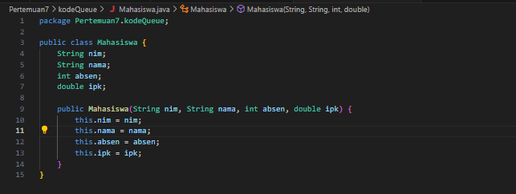

# Laporan Pertemuan 7 QUEUE
NIM: 2241760015

Nama: Oddis Nur Alifathur Razaaq

Kelas: SIB-2C

# Jobsheet 7
## 7.2 Praktikum 1
### 7.2.1 Langkah - langkah Percobaan

- Kode Queue

- Kode QueueMain

### 7.2.2 Verifikasi Hasil Percobaan

### 7.2.3 Pertanyaan
1. Pada method Create, mengapa atribut front dan rear diinisialisasi dengan nilai -1, tidak 0?

Jawab:

Menginisialisasi atribut front dan rear dengan nilai -1, dilakukan untuk mengidentifikasi bahwa antrian saat ini kosong, bukan terisi dengan elemen di posisi indeks 0. Nilai -1 digunakan sebagai penanda bahwa antrian kosong dan belum berisi elemen apa pun. Jika menginisialisasi front dan rear dengan nilai 0, maka ini akan menunjukkan bahwa ada elemen di posisi indeks 0 dalam antrian. Ini dapat menyebabkan kebingungan ketika mencoba untuk membedakan antara antrian kosong dan antrian yang memiliki satu elemen pada indeks 0.

2. Pada method Enqueue, jelaskan maksud dan kegunaan dari potongan kode berikut!

    if (rear == max - 1) {
        rear = 0;

Jawab:

Kode tersebut digunakan untuk mengatasi masalah ketika antrian telah mencapai kapasitas maksimum dan elemen terakhir sudah diisi. Dengan mengatur ulang rear ke 0.

3. Perhatikan kembali method Enqueue, baris kode program manakah yang menunjukkan bahwa data baru disimpan pada posisi terakhir di dalam queue?

Jawab:

Pada baris kode program
    Q[rear] = data;

4. Perhatikan kembali method Dequeue, baris kode program manakah yang menunjukkan bahwa data yang dikeluarkan adalah data pada posisi paling depan di dalam queue?

Jawab:

Pada baris kode program
    data = Q[front];

5. Pada method Dequeue, jelaskan maksud dan kegunaan dari potongan kode berikut!

    if (front == max -1){
        front = 0;

Jawab:

Kode tersebut digunakan untuk mengatasi situasi ketika front mencapai indeks terakhir dalam array antrian. Jika front berada di indeks terakhir, ini berarti elemen terdepan saat ini adalah elemen terakhir dalam antrian siklik Sehingga dengan mengatur ulang front ke 0, kita memungkinkan antrian tetap bersifat siklik.

6. Pada method print, mengapa pada proses perulangan variabel i tidak dimulai dari 0 (int i=0), melainkan int i=front?

Jawab:

Pada method print, penggunaan int i = front sebagai awal perulangan merupakan pendekatan yang digunakan untuk mencetak elemen-elemen dalam antrian sesuai dengan urutan sebenarnya.

7. Perhatikan kembali method print, jelaskan maksud dari potongan kode berikut!

i = (i + 1) % max;

Jawab:

Kode tersebut digunakan untuk menggeser nilai indeks i saat mencetak elemen-elemen antrian dalam implementasi berbasis array serta kode tersebut digunakan untuk mengelola indeks (variabel i) agar elemen-elemen antrian diakses secara berurutan tanpa melampaui batas kapasitas maksimum antrian (max).

## 7.3 Praktikum 2
### 7.3.1 Langkah - langkah Percobaan

- Kode Penumpang

- Kode QueuePenumpang

- Kode QueuePenumpangMain

### 7.3.2 Verifikasi Hasil Percobaan

### 7.3.3 Pertanyaan
1. Perhatikan class Queue, apa fungsi kode program berikut pada method Dequeue?

    Penumpang data = new Penumpang ("", "", "", 0, 0);

Jawab:

Kode tersebut digunakan untuk menginisialisasi objek data sebagai objek Penumpang dengan nilai-nilai default (string kosong dan 0) yang akan digunakan jika antrian dalam keadaan kosong. Method Dequeue dapat mengembalikan objek Penumpang yang sesuai jika antrian tidak berisi elemen apa pun. 

2. Pada soal nomor 1, apabila kode program tersebut diganti dengan kode berikut: 
Penumpang data = new Penumpang()
Apakah yang terjadi? Mengapa demikian?

Jawab:

Akan terjadi kesalahan kompilasi (compile error). Hal ini disebabkan oleh kelas Penumpang tidak memiliki konstruktor tanpa argumen (konstruktor default) yang didefinisikan di dalamnya. 

3. Tunjukkan kode program yang digunakan untuk menampilkan data yang dikeluarkan dari queue!

Jawab:

Kode program yang digunakan untuk menampilkan data yang dikeluarkan dari queue

    public Penumpang Dequeue() {
        Penumpang data = new Penumpang ("", "", "", 0, 0);
        if (IsEmpty()) {
            System.out.println("Queue masih kosong");
        } else {
            data = Q[front];
            size--;
            if (!IsEmpty()) {
                front = rear = -1;
            } else {
                if (front == max -1){
                    front = 0;
                } else{
                    front++;
                }
            }
        }
        return data;
    }
}

4. Lakukan modifikasi program dengan menambahkan method baru bernama peekRear pada class Queue yang digunakan untuk mengecek antrian yang berada di posisi belakang! Tambahkan pula daftar menu 5. Cek Antrian paling belakang pada class QueueMain sehingga method peekRear dapat dipanggil!

Jawab:

- Kode QueuePenumpang telah dimodifikasi

- Kode QueuePenumpangMain

- Hasil

## 7.4 Tugas
1. Tambahkan dua method berikut ke dalam class Queue pada Praktikum1:
a. Method peekPosition(data: int) : void
Untuk menampilkan posisi dari sebuah data di dalam queue, misalnya dengan mengirimkan data tertentu, akan diketahui posisi (indeks) data tersebut berada di urutan keberapa
b. Method peekAt(position: int) : void
Untuk menampilkan data yang berada pada posisi (indeks) tertentu Sesuaikan daftar menu yang terdapat pada class QueueMain sehingga kedua method tersebut dapat dipanggil!

Jawab:

- Kode Tugas1

- Kode Tugas1Main

- Hasil

2. Buatlah program antrian untuk mengilustasikan mahasiswa yang sedang meminta tanda tangan KRS pada dosen DPA di kampus. Ketika seorang mahasiswa akan mengantri, maka dia harus menuliskan terlebih dulu NIM, nama, absen, dan IPK seperti yang digambarkan pada Class diagram berikut:

Catatan:
    • Method create(), isEmpty(), isFull(), enqueue(), dequeue() dan print(), kegunaannya sama seperti yang telah dibuat pada Praktikum
    • Method peek(): digunakan untuk menampilkan data Mahasiswa yang berada di posisi antrian paling depan
    • Method peekRear(): digunakan untuk menampilkan data Mahasiswa yang berada di posisi antrian paling belakang
    • Method peekPosition(): digunakan untuk menampilkan posisi antrian ke berapa, seorang Mahasiswa berada. Pengecekan dilakukan berdasarkan NIM
    • Method printMahasiswa(): digunakan untuk menampilkan data mahasiswa pada suatu posisi tertentu dalam antrian

Jawab:

- Kode Mahasiswa

- Kode QueueMahasiswa

- Kode QueueMahasiswaMain

- Hasil

