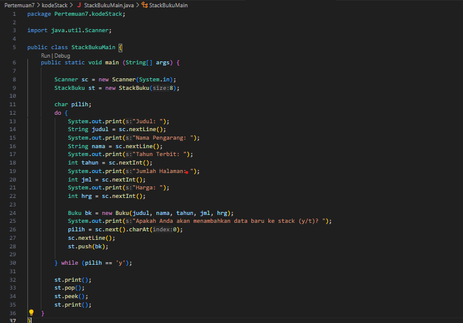
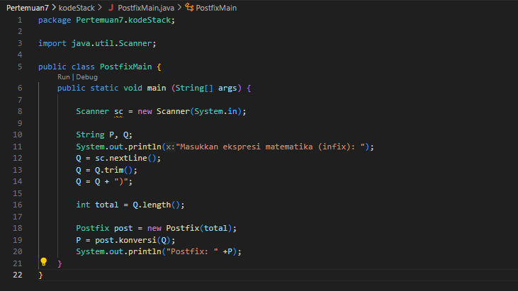

# Laporan Pertemuan 7 STACK
NIM: 2241760015

Nama: Oddis Nur Alifathur Razaaq

Kelas: SIB-2C

# Jobsheet 7
## 7.2 Praktikum 1
### 7.2.1 Langkah - langkah Percobaan

- Kode Stack

- Kode StackMain

### 7.2.2 Verifikasi Hasil Percobaan

### 7.2.3 Pertanyaan
1. Perhatikan class StackMain, apakah fungsi angka 5 pada potongan kode program berikut?

    Stack stk = new Stack(5);

Jawab:

Fungsi angka 5 pada baris Stack stk = new Stack(5); digunakan untuk menginisialisasi objek stk sebagai instance dari kelas Stack. Angka 5 adalah argumen yang diberikan kepada konstruktor Stack yang telah didefinisikan dalam kelas Stack. Dalam konstruktor Stack, argumen tersebut mengatur ukuran maksimum dari stack yang akan dibuat. Stack akan dibuat dengan kapasitas maksimal 5 elemen. Berarti stack ini akan dapat menyimpan hingga 5 elemen sebelum dianggap penuh.

2. Lakukan penambahan data ke stack sebanyak dua kali, menggunakan angka 18 dan 40. Tampilkan hasilnya!

Jawab:

- Kode setelah menambahkan data pada StackMain menggunakan angka 18 dan 40

- Hasil setelah menambahkan data pada StackMain menggunakan angka 18 dan 40

3. Pada soal nomor 2, mengapa data yang dimasukkan ke dalam Stack hanya angka 18, sedangkan angka 40 tidak dimasukkan? Jelaskan!

Jawab:

Data 18 dan 40 dimasukkan ke dalam stack, tetapi terdapat perintah stk.pop(), yang menghapus elemen teratas dari stack. Oleh karena itu, elemen 40 dihapus dari stack dengan stk.pop(). Karena angka 40 merupakan elemen teratas dari stack.

## 7.3 Praktikum 2
### 7.3.1 Langkah - langkah Percobaan

- Kode Buku

- Kode StackBuku

- Kode StackBukuMain

### 7.3.2 Verifikasi Hasil Percobaan

### 7.3.3 Pertanyaan
1. Perhatikan class StackMain, pada saat memanggil fungsi push parameter yang dikirimkan adalah bk. Data apa yang tersimpan pada variabel bk tersebut?

    st.push(bk);

Jawab:

Variabel bk menyimpan objek buku yang dibuat dalam do-while loop sesuai dengan input yaitu judul, nama pengarang, tahun terbit, jumlah halaman, dan harga buku. 

2. Tunjukkan potongan kode program untuk menentukan kapasitas penampungan stack!

Jawab:

Potongan kode program untuk menemtukan kapasitas stack buku yaitu:

    int size;
    public Buku (int size) {
    this.size = size;
    data = new Buku[size];
    top = -1;
    }

3. Apakah fungsi penggunaan do-while yang terdapat pada class StackBukuMain?

Jawab:

Untuk memasukkan detail buku baru ke dalam stack secara berulang - ulang sesuai dengan kebutuhan.

4. Modifikasi kode program pada class StackMain sehingga pengguna dapat memilih operasioperasi pada stack (push, pop, peek, atau print) melalui pilihan menu program!

Jawab:

- StuckBukuMain setelah dimodifikasi agar dapat memilih operasioperasi pada stack (push, pop, peek, atau print) melalui pilihan menu program

- Hasil Setelah dimodifikasi

## 7.4 Praktikum 3
### 7.4.1 Langkah - langkah Percobaan

- Kode Postfix

- PostfixMain

### 7.4.2 Verifikasi Hasil Percobaan

### 7.4.3 Pertanyaan
1. Perhatikan class Postfix, jelaskan alur kerja method derajat!

Jawab:

Alur kerja Method derajad(char c):

    a. Pertama method derajat menerima parameter c sebagai argumen.
    b. Kemudian terdapat blok switch yang memeriksa nilai c, setiap operatornya memiliki prioritas atau level yang berbeda
        - Operator '^' (pangkat) memiliki derajat prioritas 3.

        - Operator '%', '/', dan '*' memiliki derajat prioritas 2.

        - Operator '-' dan '+' memiliki derajat prioritas 1.

        - Jika karakter c tidak cocok dengan operator yang dikenal, maka derajat yang dikembalikan adalah 0.

    c. setelah memeriksa nilai c, method derajat akan mengembalikan nilai derajat prioritas yang sesuai berdasarkan operator.

2. Apa fungsi kode program berikut?

    c = Q.charAt(i);

Jawab:

Kode tersebut berfungsi untuk mengambil karakter dari string Q pada posisi i dan menyimpan karakter tersebut dalam variabel c. Ini adalah cara untuk mengakses karakter individu dalam string.

3. Jalankan kembali program tersebut, masukkan ekspresi 3*5^(8-6)%3. Tampilkan hasilnya!

Jawab:

- Hasil 

4. Pada soal nomor 2, mengapa tanda kurung tidak ditampilkan pada hasil konversi? Jelaskan!

Jawab:

Karena tanda kurung (buka dan tutup) digunakan untuk mengatur urutan operasi dalam stack sementara sehingga tidak dimasukkan ke dalam notasi postfix.

Penjelasan:
Dalam algoritma konversi, saat tanda kurung buka ("(") ditemukan, tanda kurung tersebut akan dimasukkan ke dalam stack sementara. Kemudian, ketika tanda kurung tutup (")") ditemukan, operasi dalam tanda kurung akan dieksekusi terlebih dahulu, dan tanda kurung akan dihapus dari stack sementara. Dengan cara ini, algoritma konversi dapat mempertahankan urutan operasi yang benar dan menghasilkan notasi postfix yang sesuai tanpa memasukkan tanda kurung ke dalam notasi postfix, karena urutan operasi telah ditentukan oleh posisi operand dan operator dalam notasi postfix.

## 7.5 Tugas
1. Buat program dengan menggunakan konsep Stack untuk memasukkan sebuah kalimat, kemudian keluaran yang ditampilkan berupa kalimat dengan urutan karakter terbalik!

Jawab:

- Kode Tugas1

- Kode Tugas1Main

- Hasil

2. Setiap hari Minggu, Dewi pergi berbelanja ke salah satu supermarket yang berada di area rumahnya. Setiap kali selesai berbelanja, Dewi menyimpan struk belanjaannya di dalam laci. Setelah dua bulan, ternyata Dewi sudah mempunyai delapan struk belanja. Dewi berencana mengambil lima struk belanja untuk ditukarkan dengan voucher belanja. Buat sebuah program stack untuk menyimpan data struk belanja Dewi, kemudian lakukan juga proses pengambilan data struk belanja. Informasi yang tersimpan pada struk belanja terdiri dari:
    • Nomor transaksi
    • Tanggal pembelian
    • Jumlah barang yang dibeli
    • Total harga bayar

Jawab:

- Kode Tugas2

- Kode Tugas2Main

- Hasil

