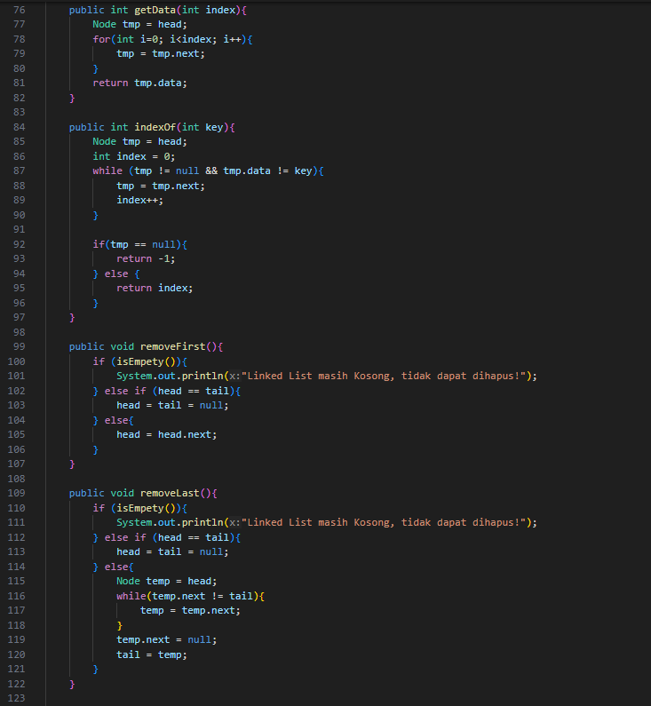

# Laporan Pertemuan 8
NIM: 2241760015

Nama: Oddis Nur Alifathur Razaaq

Kelas: SIB-2C

# Jobsheet 9
## 9.2 Praktikum 1
### 9.2.1 Langkah - langkah Percobaan

- Node

- SingleLinkedList

- SLLMain

### 9.2.2 Verifikasi Hasil Percobaan

### 9.2.3 Pertanyaan

1. Mengapa hasil compile kode program di baris pertama menghasilkan “Linked List Kosong”?

Jawab:

Karena pada saat program pertama kali dijalankan, objek SingleLinkedList dibuat, tetapi belum ada node yang ditambahkan ke dalam linked list, hasil compile program di baris pertama menghasilkan "Linked List Kosong". Akibatnya, metode print() dalam class SingleLinkedList mendeteksi bahwa linked list masih kosong.

2. Pada step 10, jelaskan kegunaan kode berikut

    ndInput.next = temp.next;
    temp.next = ndInput;

Jawab:

Kode ndInput.next = temp.next; digunakan untuk mengatur pointer (next) dari node ndInput agar menunjuk ke node yang berikutnya dari node temp. Kemudian, temp.next = ndInput; digunakan untuk mengatur pointer (next) dari node temp agar menunjuk ke node ndInput, sehingga node ndInput akan masuk ke dalam linked list dan terletak setelah node temp. Dengan kata lain, kode ini digunakan untuk menyisipkan node ndInput setelah node dengan data yang sesuai (ditemukan dalam temp) dalam linked list.

3. Perhatikan class SingleLinkedList, pada method insertAt Jelaskan kegunaan kode berikut
    
    if(temp.next.next == null) tail =temp.next;

Jawab:

Kode if (temp.next.next == null) tail = temp.next; digunakan untuk memeriksa apakah node temp yang ditambahkan baru saja ke dalam linked list adalah node terakhir dalam linked list. Jika temp.next.next adalah null, berarti temp adalah node terakhir sebelum penambahan node baru. Oleh karena itu, tail dari linked list diatur agar menunjuk ke node yang baru ditambahkan (temp.next). Hal ini diperlukan agar tail selalu menunjuk ke node terakhir dalam linked list, sehingga operasi tambah node di akhir (seperti addLast) dapat berjalan dengan benar.

## 9.3 Praktikum 2
### 9.3.1 Langkah - langkah Percobaan

- Node

- SingleLinkedList

- SLLMain

### 9.3.2 Verifikasi Hasil Percobaan

### 9.3.3 Pertanyaan
1. Mengapa digunakan keyword break pada fungsi remove? Jelaskan!

Jawab:

Keyword break digunakan untuk menghentikan iterasi setelah operasi penghapusan selesai dilakukan. Ketika kita menemukan node yang ingin dihapus (node dengan nilai key), kita perlu menghentikan iterasi agar tidak perlu memeriksa node lain. Hal itu karena setelah operasi penghapusan dilakukan, tidak perlu lagi melanjutkan iterasi untuk menemukan node dengan nilai yang sama. Sehingga, break digunakan untuk menghindari iterasi yang tidak perlu setelah operasi penghapusan berhasil.

2. Jelaskan kegunaan kode dibawah pada method remove
     else if (temp.next.data == key){
        temp.next = temp.next.next;

Jawab:

Kode temp.next.data == key digunakan untuk memeriksa apakah node berikutnya (temp.next) memiliki nilai yang sama dengan key. Jika benar, maka menandakan bahwa node tersebut adalah node yang ingin dihapus. Kemudian, temp.next = temp.next.next; digunakan untuk mengatur pointer node temp sehingga node yang ditunjuk oleh temp.next adalah node setelah node yang ingin dihapus. Dengan melakukan hal ini, node yang ingin dihapus dilewati dalam linked list, sehingga secara efektif dihapus dari linked list.

3. Apa saja nilai kembalian yang dapat dikembalikan pada method indexOf? Jelaskan maksud
masing-masing kembalian tersebut!

Jawab:

Method indexOf mengembalikan satu nilai, yaitu index dari node yang memiliki nilai yang sama dengan key dalam linked list. 
Kemudian nilai yang mungkin dikembalikan adalah:
    a. Jika node dengan nilai yang sesuai ditemukan, maka index node tersebut akan dikembalikan (index dimulai dari 0 untuk node pertama).
    b. Jika node dengan nilai yang sesuai tidak ditemukan, maka -1 akan dikembalikan untuk menunjukkan bahwa nilai tersebut tidak ada dalam linked list.

## 9.4 Tugas
1. Buat method insertBefore untuk menambahkan node sebelum keyword yang diinginkan

Jawab:

- Node

- SingleLinkedList (Menambahkan method insertBefore)

- SLLMain (Menambahkan pemanggilan insertBefore)

- Output

2. Implementasikan ilustrasi Linked List Berikut. Gunakan 4 macam penambahan data yang telah dipelajari sebelumnya untuk menginputkan data.

Jawab:

- Node

- SingleLinkedList

- SLLMain

- Output

3. Buatlah Implementasi Stack berikut menggunakan Linked List

Jawab:

- SLLMain

- Output

4. Buatlah implementasi program Nasabah Bank menggunakan LinkedList dengan data berupa
nama, alamat dan nomor rekening nasabah

Jawab:

- NasabahBank

- LinkedListNasabah

- NasabahBankMain

- Output

5. Implementasikan Queue pada antrian Nasabah pada nomor 4 dengan menggunakan konsep
LinkedList!

Jawab:

- LinkedListNasabah saat mengimplementasikan Queue

- Main NasabahBank setelah implementasi QUEUE

- Output

