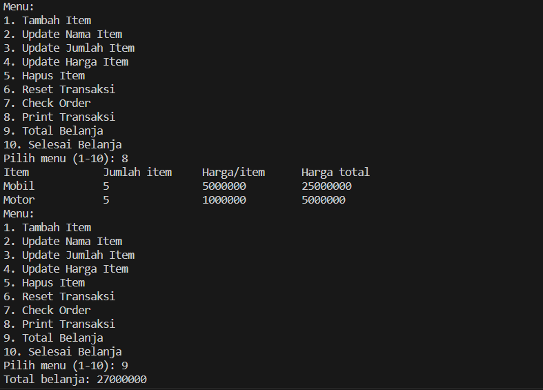

# Laporan Quiz 1
NIM: 2241760015

Nama: Oddis Nur Alifathur Razaaq

Kelas: SIB-2C

## Flow chart

## Fungsi-fungsi yang digunakan beserta penjelasan alur kerjanya
1. Transaction class:
   - add_item(String itemName, int quantity, int price): Method ini digunakan untuk menambahkan item baru ke dalam transaksi. Item tersebut memiliki nama, jumlah, dan harga per item.
   - update_item_name(String itemName, String updatedName): Method ini memungkinkan Anda untuk mengupdate nama item yang sudah ada dalam transaksi.
   - update_item_qty(String itemName, int updatedQty): Method ini memungkinkan Anda untuk mengupdate jumlah item yang sudah ada dalam transaksi.
   - update_item_price(String itemName, int updatedPrice): Method ini memungkinkan Anda untuk mengupdate harga per item yang sudah ada dalam transaksi.
   - delete_item(String itemName): Method ini memungkinkan Anda untuk menghapus item dari transaksi berdasarkan nama item.
   - reset_transaction(): Method ini digunakan untuk menghapus semua item dari transaksi, sehingga transaksi menjadi kosong.
   - check_order(): Method ini memeriksa apakah ada kesalahan dalam input data seperti nama item kosong, jumlah item negatif, atau harga item negatif. Jika ada kesalahan, akan menampilkan pesan kesalahan; jika tidak, akan menampilkan pesan bahwa pemesanan sudah benar.
   - total_price(): Method ini menghitung total belanja yang sudah dibeli dengan mempertimbangkan diskon berdasarkan total harga belanja.
   - print_transaction(): Method ini mencetak detail transaksi seperti nama item, jumlah item, harga per item, dan harga total untuk setiap item dalam transaksi.

2. Item class:
   - Ini adalah inner class yang digunakan untuk merepresentasikan item dalam transaksi. Setiap item memiliki atribut nama, jumlah, dan harga per item.

3. MainTransaction class:
   - Ini adalah class utama yang memiliki metode main.
   - Di dalam main, terdapat loop yang memungkinkan pengguna untuk memilih berbagai opsi menu.
   - Pengguna dapat menambahkan item baru, mengupdate item yang sudah ada, menghapus item, mereset transaksi, memeriksa pesanan, mencetak transaksi, menghitung total belanja, atau selesai berbelanja.
   - Setiap opsi menu akan memanggil method yang sesuai dari Transaction class.
   - Total belanja akan dihitung berdasarkan peraturan diskon yang telah ditentukan dan ditampilkan kepada pengguna.

Penjelasan alur:
Berikut adalah penjelasan alur kerja program:

1. Pengguna memulai program dengan menjalankan MainTransaction class.

2. Program menampilkan menu pilihan kepada pengguna:
   Menu:
   1. Tambah Item
   2. Update Nama Item
   3. Update Jumlah Item
   4. Update Harga Item
   5. Hapus Item
   6. Reset Transaksi
   7. Check Order
   8. Print Transaksi
   9. Total Belanja
   10. Selesai Belanja

3. Pengguna memilih salah satu dari menu tersebut dengan memasukkan nomor menu yang sesuai.

4. Program melakukan tindakan sesuai dengan pilihan pengguna:

   - Jika pengguna memilih "Tambah Item" (menu 1), program meminta pengguna untuk memasukkan nama item, jumlah item, dan harga per item. Kemudian, item tersebut ditambahkan ke dalam transaksi menggunakan method add_item dari Transaction class.

   - Jika pengguna memilih "Update Nama Item" (menu 2), program meminta pengguna untuk memasukkan nama item yang ingin diupdate dan nama baru untuk item tersebut. Method update_item_name dari Transaction class digunakan untuk melakukan update.

   - Jika pengguna memilih "Update Jumlah Item" (menu 3), program meminta pengguna untuk memasukkan nama item yang ingin diupdate jumlahnya dan jumlah baru. Method update_item_qty dari Transaction class digunakan untuk melakukan update.

   - Jika pengguna memilih "Update Harga Item" (menu 4), program meminta pengguna untuk memasukkan nama item yang ingin diupdate harganya dan harga baru. Method update_item_price dari Transaction class digunakan untuk melakukan update.

   - Jika pengguna memilih "Hapus Item" (menu 5), program meminta pengguna untuk memasukkan nama item yang ingin dihapus. Item tersebut dihapus dari transaksi menggunakan method delete_item dari Transaction class.

   - Jika pengguna memilih "Reset Transaksi" (menu 6), seluruh transaksi dibersihkan (di-reset) menggunakan method reset_transaction dari Transaction class.

   - Jika pengguna memilih "Check Order" (menu 7), program memeriksa apakah ada kesalahan dalam input data seperti nama item kosong, jumlah item negatif, atau harga item negatif. Hasil pemeriksaan ditampilkan dengan menggunakan method check_order dari Transaction class.

   - Jika pengguna memilih "Print Transaksi" (menu 8), program mencetak detail transaksi termasuk nama item, jumlah item, harga per item, dan harga total untuk setiap item dalam transaksi menggunakan method print_transaction dari Transaction class.

   - Jika pengguna memilih "Total Belanja" (menu 9), program menghitung total belanja yang sudah dibeli berdasarkan peraturan diskon yang telah ditentukan menggunakan method total_price dari Transaction class. Total belanja kemudian ditampilkan kepada pengguna.

   - Jika pengguna memilih "Selesai Belanja" (menu 10), program keluar dari loop dan berhenti.

5. Program mengulang proses dari langkah 3 selama pengguna belum memilih "Selesai Belanja" (menu 10).

## Contoh Output 
### Contoh output 1
1. Disini saya mencoba untuk menambahkan 2 item Mobil dan juga Motor, kemudian saya juga meng- update jumlah dan harga masing-masing item tersebut.Berikut hasil contohnya:
- 

### Contoh output 2
2. Kemudian saya juga mencoba untuk meng- update nama item dan juga mengupdate harga item. Berikut hasil contohnya:

### Contoh output 3
3. Kemudian saya juga mencoba untuk menghapus salah satu itemnya. Berikut hasil contohnya:

## SWAFOTO

